Вопросы по теоретической части:
==================================

1.  [Понятие машинного обучения. Отличие машинного обучения от других областей программирования.](#h.5oygzmuuo31j)
2.  [Классификация задач машинного обучения. Примеры задач из различных классов.](#h.ha4aq79rz2m2)
3.  [Основные понятия машинного обучения: набора данных, объекты, признаки, атрибуты, модели, параметры.](#h.wntqv0jqil4o)
4.  [Структура и представление данных для машинного обучения.](#h.muo3i433utjd)
5.  [Инструментальные средства машинного обучения.](#h.tz1xw6ro3ujs)
6.  [Задача регрессии: постановка, математическая формализация.](#h.kzu2gqf4adxy)
7.  [Метод градиентного спуска для парной линейной регрессии.](#h.xbubnen2zjp5)
8.  [Понятие функции ошибки: требования, использование, примеры.](#h.l1qtgiivf57w)
9.  [Множественная и нелинейная регрессии.](#h.sqyedbp762ru)
10.  [Нормализация признаков в задачах регрессии.](#h.ft8kejfdgpol)
11.  [Задача классификации: постановка, математическая формализация.](#h.eafbkxdqwm1r)
12.  [Метод градиентного спуска для задач классификации.](#h.jxec3itmilkh)
13.  [Логистическая регрессия в задачах классификации.](#h.9zhguo8lyu9y)
14.  [Множественная и многоклассовая классификация. Алгоритм “один против всех”.](#h.ivw7eakwt7lo)
15.  [Метод опорных векторов в задачах классификации.](#h.55s3dx6tpa5z)
16.  [Понятие ядра и виды ядер в методе опорных векторов.](#h.5d7w6h5m5cb)
17.  [Метод решающих деревьев в задачах классификации.](#h.zh8ymuo26u5h)
18.  [Метод k ближайших соседей в задачах классификации.](#h.22tl9sbgtc37)
19.  [Однослойный перцептрон в задачах классификации.](#h.p7ntd1lrm30t)
20.  [Метрики эффективности и функции ошибки: назначение, примеры, различия.](#h.xeeuprce2hsp)
21.  [Понятие набора данных (датасета) в машинном обучении. Требования, представление. Признаки и объекты.](#h.5m9iadqbdy82)
22.  [Шкалы измерения признаков. Виды шкал, их характеристика.](#h.ke8goj6p9pt5)
23.  [Понятие чистых данных. Определение, очистка данных.](#h.bld0hyn96t79)
24.  [Основные этапы проекта по машинному обучению.](#h.l4stdp9bw8lh)
25.  [Предварительный анализ данных: задачи, методы, цели.](#h.z80m4ui3q0fe)
26.  [Проблема отсутствующих данных: причины, исследование, пути решения.](#h.gobokj8cp4qs)
27.  [Проблема несбалансированных классов: исследование, пути решения.](#h.rb7e545dynkb)
28.  [Понятие параметров и](#h.xfwkaxhfnppl) [гиперпараметров](#h.xfwkaxhfnppl) [модели. Обучение параметров и](#h.xfwkaxhfnppl) [гиперпараметров](#h.xfwkaxhfnppl)[. Поиск по сетке.](#h.xfwkaxhfnppl)
29.  [Понятие недо- и переобучения. Определение, пути решения.](#h.l1zxcawiwkhh)
30.  [Диагностика модели машинного обучения. Методы, цели.](#h.uyi4fxpkf6dh)
31.  [Проблема выбора модели машинного обучения. Сравнение моделей.](#h.rgm4aq5u4fm1)
32.  [Измерение эффективности работы моделей машинного обучения. Метрики эффективности.](#h.tt2bm2t5fsmz)
33.  [Метрики эффективности моделей классификации. Виды, характеристика, выбор.](#h.2fkngdy9vfy3)
34.  [Метрики эффективности моделей регрессии. Виды, характеристика, выбор.](#h.igimsg74yy3y)
35.  [Перекрестная проверка (кросс-валидация). Назначение, схема работы.](#h.61ozgxt8e77z)
36.  [Конвейеры в библиотеке sklearn. Назначение, использование.](#h.qu1mkvp5qlj6)
37.  [Использование методов визуализации данных для предварительного анализа.](#h.im2uu4tpwqe1)
38.  [Исследование коррелированности признаков: методы, цели, выводы.](#h.pxm6w4ocrpzt)
39.  [Решкалирование данных. Виды, назначение, применение. Нормализация и стандартизация данных.](#h.uv5aor77se84)
40.  [Преобразование категориальных признаков в числовые.](#h.v7jzh1av3g54)
41.  [Методы визуализации данных для машинного обучения.](#h.re9plz1dqe9t)
42.  [Задача выбора модели. Оценка эффективности, валидационный набор.](#h.ist67k408ick)
43.  [Кривые обучения для диагностики моделей машинного обучения.](#h.6rmj7hj3o4nm)
44.  [Регуляризация моделей машинного обучения. Назначение, виды, формализация.](#h.6yp5ahek3ce0)
45.  [Проблема сбора и интеграции данных для машинного обучения.](#h.fd7be22l7t26)
46.  [Понятие чистых данных и требования к данным.](#h.deyj2phls7bu)
47.  [Основные задачи описательного анализа данных.](#h.b3gi0n5fzzom)
48.  [Полиномиальные модели машинного обучения.](#h.wpabvj6zyjvx)
49.  [Основные виды преобразования данных для подготовки к машинному обучению.](#h.wmbba8m9cn66)
50.  [Задача выбора признаков в машинном обучении.](#h.7g2qejvheaee)

Не будет на экзамене, мы это не прошли

51.  Ансамблевые модели машинного обучения. Виды ансамблирования.
52.  Конвейеризация моделей машинного обучения.
53.  Методы векторизации текстов для задач машинного обучения.
54.  Представление графической информации в моделях машинного обучения.
55.  Задачи без учителя. Кластеризация. Метод k средних.
56.  Задачи без учителя. Обнаружение аномалий.
57.  Задачи без учителя. Понижение размерности. Метод PCA.
58.  Воспроизводимость алгоритма преобразования данных в машинном обучении.
59.  Случайный лес как ансамблевая модель машинного обучения.
60.  Частичное обучение с учителем.

1.  Понятие машинного обучения. Отличие машинного обучения от других областей программирования.
    ===========================================================================================
    

Машинное обучение – это наука о разработке алгоритмов и статистических моделей, которые компьютерные системы используют для выполнения задач без явных инструкций, полагаясь вместо этого на шаблоны и логические выводы. Компьютерные системы используют алгоритмы машинного обучения для обработки больших объемов статистических данных и выявления шаблонов данных. Таким образом, системы могут более точно прогнозировать результаты на основе заданного набора входных данных. Например, специалисты по работе с данными могут обучить медицинское приложение диагностировать рак по рентгеновским изображениям, сохраняя миллионы отсканированных изображений и соответствующие диагнозы.

Машинное обучение предназначено для обучения машин на исторических данных, чтобы они могли обрабатывать новые входящие данные на основании изученных паттернов без программирования, то есть без создаваемых вручную команд для выполнения системой действий. Если бы машинного обучения не существовало, то движки рекомендаций было бы создать невозможно, ведь человеку сложно было бы обработать миллионы поисковых запросов, оценок и обзоров, чтобы определить, какие покупатели покупают удочки с прикормом, а какие покупают дополнительно и леску.

В традиционном программировании вы жестко задаете поведение программы. В машинном обучении вы многое оставляете машине для обучения на основе данных. Следовательно, эти термины не являются взаимозаменяемыми: специалист по данным не может заменить работу традиционного программиста и наоборот.

ML, как и AI, — это не замена, а дополнение к традиционным подходам разработки. Например, ML можно использовать при разработке прогнозирующих алгоритмов для интернет-магазина, в то время как пользовательский интерфейс, визуализация данных и другие его элементы будут разрабатываться на общепринятых для этого языках программирования, таких как Ruby или Java.

Итак, главное: ML используется в том случае, когда традиционные подходы разработки отстают и или их недостаточно для полной реализации определенной задачи.

2.  Классификация задач машинного обучения. Примеры задач из различных классов.
    ===========================================================================
    

#### Классификация задач:

МОЖНО СОКРАЩАТЬ

#### Обучение с учителем (англ. Supervised learning [\[3\]](https://www.google.com/url?q=https://neerc.ifmo.ru/wiki/index.php?title%3D%25D0%259E%25D0%25B1%25D1%2589%25D0%25B8%25D0%25B5_%25D0%25BF%25D0%25BE%25D0%25BD%25D1%258F%25D1%2582%25D0%25B8%25D1%258F%23cite_note-3&sa=D&source=editors&ust=1674518513267590&usg=AOvVaw26MCU5iVPaOXBq2Y-Lmtjk))

Задачи, которые могут решаться этим способом: классификация, регрессия.

#### Обучение без учителя (англ. Unsupervised learning)

Изучает широкий класс задач обработки данных, в которых известны только описания множества объектов (обучающей выборки), и требуется обнаружить внутренние взаимосвязи, зависимости, закономерности, существующие между объектами. Т.е. тренировочные данные доступны все сразу, но ответы для поставленной задачи неизвестны.

Задачи, которые могут решаться этим способом: кластеризация, нахождение ассоциативных правил, выдача рекомендаций (например, реклама), уменьшение размерности датасета, [обработка естественного языка](https://www.google.com/url?q=https://neerc.ifmo.ru/wiki/index.php?title%3D%25D0%259E%25D0%25B1%25D1%2580%25D0%25B0%25D0%25B1%25D0%25BE%25D1%2582%25D0%25BA%25D0%25B0_%25D0%25B5%25D1%2581%25D1%2582%25D0%25B5%25D1%2581%25D1%2582%25D0%25B2%25D0%25B5%25D0%25BD%25D0%25BD%25D0%25BE%25D0%25B3%25D0%25BE_%25D1%258F%25D0%25B7%25D1%258B%25D0%25BA%25D0%25B0&sa=D&source=editors&ust=1674518513268498&usg=AOvVaw31TXkGsvBCIS6F_5RjptGx).

#### Обучение с частичным привлечением учителя (англ. Semi-supervised learning[\[4\]](https://www.google.com/url?q=https://neerc.ifmo.ru/wiki/index.php?title%3D%25D0%259E%25D0%25B1%25D1%2589%25D0%25B8%25D0%25B5_%25D0%25BF%25D0%25BE%25D0%25BD%25D1%258F%25D1%2582%25D0%25B8%25D1%258F%23cite_note-4&sa=D&source=editors&ust=1674518513268880&usg=AOvVaw3SIIQ4MqC3x1OCjarRwhk9))

Занимает промежуточное положение между обучением с учителем и без учителя. Каждый прецедент представляет собой пару «объект, ответ», но ответы известны только на части прецедентов (Размечено мало, либо малоинформативная часть).

Примером частичного обучения может послужить сообучение: два или более обучаемых алгоритма используют один и тот же набор данных, но каждый при обучении использует различные — в идеале некоррелирующие — наборы признаков объектов.

#### Обучение с подкреплением (англ. Reinforcement learning)

Частный случай обучения с учителем, сигналы подкрепления (правильности ответа) выдаются не учителем, а некоторой средой, с которой взаимодействует программа. Размеченность данных зависит от среды.

Окружение обычно формулируется как [марковский процесс принятия решений](https://www.google.com/url?q=http://en.wikipedia.org/wiki/Markov_decision_process&sa=D&source=editors&ust=1674518513269735&usg=AOvVaw3A4GGQ1RNXgANw0O7zyxTd) (МППР) с конечным множеством состояний, и в этом смысле алгоритмы обучения с подкреплением тесно связаны с динамическим программированием. Вероятности выигрышей и перехода состояний в МППР обычно являются величинами случайными, но стационарными в рамках задачи.

При обучении с подкреплением, в отличие от обучения с учителем, не предоставляются верные пары "входные данные-ответ", а принятие субоптимальных решений (дающих локальный экстремум) не ограничивается явно. Обучение с подкреплением пытается найти компромисс между исследованием неизученных областей и применением имеющихся знаний (англ. exploration vs exploitation tradeoff).

#### Активное обучение (англ. Active learning)

Отличается тем, что обучаемый имеет возможность самостоятельно назначать следующий прецедент, который станет известен. Применяется когда получение истиной метки для объекта затруднительно. Поэтому алгоритм должен уметь определять, на каких объектах ему надо знать ответ, чтобы лучше всего обучиться, построить наилучшую модель.

#### Обучение в реальном времени (англ. Online learning)

Может быть как обучением с учителем, так и без учителя. Специфика в том, что тренировочные данные поступают последовательно. Требуется немедленно принимать решение по каждому прецеденту и одновременно доучивать модель зависимости с учётом новых прецедентов. Здесь существенную роль играет фактор времени.

Примеры задач
-------------

*   Оценивание кредитоспособности заёмщиков

Эта задача решается банками при выдаче кредитов. Объектами в данном случае являются физические или юридические лица, претендующие на получение кредита.

В случае физических лиц признаковое описание состоит из:

*   анкеты, которую заполняет сам заёмщик;
*   дополнительной информации, которую банк собирает о нём из собственных источников.

Можно выделить следующие признаки:

*   Бинарные признаки: пол, наличие телефона;
*   Номинальные признаки: место проживания, профессия, работодатель;
*   Порядковые признаки: образование, занимаемая должность;
*   Числовые признаки:сумма кредита, возраст, стаж работы, доход семьи, размер задолженностей в других банках.

Обучающая выборка составляется из заёмщиков с известной кредитной историей.

На стадии обучения производится синтез и отбор информативных признаков и определяется, сколько баллов назначать за каждый признак, чтобы риск принимаемых решений был минимален. Чем выше суммарное число баллов заёмщика, набранных по совокупности информативных признаков, тем более надёжным считается заёмщик.

*   Задачи медицинской диагностики

В роли объектов выступают пациенты. Признаки характеризуют результаты обследований, симптомы заболевания и применявшиеся методы лечения.

*   Бинарные признаки: пол, наличие головной боли, слабости;
*   Порядковый признак: тяжесть состояния (удовлетворительное, средней тяжести, тяжёлое, крайне тяжёлое);
*   Числовые признаки:возраст, пульс, артериальное давление, содержание гемоглобина в крови, доза препарата.

Признаковое описание пациента является, по сути дела, формализованной историей болезни.

Накопив достаточное количество данных, можно решать различные задачи:

*   классифицировать вид заболевания (дифференциальная диагностика);
*   определять наиболее целесообразный способ лечения;
*   предсказывать длительность и исход заболевания;
*   оценивать риск осложнений;
*   находить наиболее характерные для данного заболевания совокупности симптомов.

Ценность такого рода систем в том, что они способны мгновенно анализировать и обобщать огромное количество прецедентов — возможность, недоступная специалисту-врачу.

*   Задача классификации видов ириса (Фишер 1936)

3.  Основные понятия машинного обучения: набора данных, объекты, признаки, атрибуты, модели, параметры.
    ===================================================================================================
    

*   Набор данных:

Под данными для обучения понимается исходный набор данных, передаваемый модели машинного обучения, на котором обучается модель. Люди лучше всего учатся на примерах, и машинам тоже нужен набор данных, чтобы узнавать из него паттерны.

*   Объекты:

Объекты в машинном обучении описываются набором признаков. Вернемся к примеру с кофе из прошлой статьи: там объектами были люди, и мы описывали их единственным признаком – количеством сна. Признаки иначе называются независимыми переменными.

*   Признаки:

Признак (переменная, фича, атрибут, столбец, функция) – это объективная характеристика, характерная черта или свойство, которое может быть определено или измерено.

Атрибуты:

Составные части объекта машинного обучения  

*   Модели:

Моделью машинного обучения называется файл, который обучен распознаванию определенных типов закономерностей. Вы обучаете модель на основе набора данных, предоставляя ей алгоритм, который она может использовать для анализа и обучения на основе этих данных.

*   Параметры:

В машинном обучении гиперпараметрами называют параметры алгоритмов, значения которых устанавливаются перед запуском процесса обучения. В этом смысле они и отличаются от обычных параметров, вычисляемых в процессе обучения.

4.  Структура и представление данных для машинного обучения.
    ========================================================
    

Dataset для машинного обучения – это обработанная и структурированная информация в табличном виде. Строки такой таблицы называются объектами, а столбцы – признаками. Различают 2 вида признаков \[1\]:

*   независимые переменные – предикторы;
*   зависимые переменные – целевые признаки, которые вычисляются на основе одного или нескольких предикторов.

Признаковое описание характерно для задач классификации, когда имеется выборка – конечное множество объектов, для которых известно, к каким классам они относятся. Классовая принадлежность остальных объектов неизвестна. В процессе машинного обучения строится модель, способная классифицировать произвольный объект из исходного множества \[2\]. Практический смысл задач классификации состоит в предсказании возможных исходов на основе совокупности входных переменных, например, диагностика заболеваний, предварительная оценка эффективности месторождений полезных ископаемых, кредитный скоринг, распознавание речи, [прогнозирование](https://www.google.com/url?q=https://www.bigdataschool.ru/wiki/%25d0%25bf%25d1%2580%25d0%25be%25d0%25b3%25d0%25bd%25d0%25be%25d0%25b7%25d0%25b8%25d1%2580%25d0%25be%25d0%25b2%25d0%25b0%25d0%25bd%25d0%25b8%25d0%25b5&sa=D&source=editors&ust=1674518513275618&usg=AOvVaw2hwzgYb0Kb47BTZlXnsduH) оттока клиентов ([Churn Rate](https://www.google.com/url?q=https://www.bigdataschool.ru/wiki/churn-rate&sa=D&source=editors&ust=1674518513275922&usg=AOvVaw1mQ7VyUnEuYeHQENUAjVfy)) и т.д.

В зависимости от варианта задачи классификации, целевой признак может выглядеть по-разному \[1\]:

*   один столбец с двоичными значениями (1/0, TRUE/FALSE и пр.): двухклассовая [классификация](https://www.google.com/url?q=https://www.bigdataschool.ru/wiki/%25d0%25ba%25d0%25bb%25d0%25b0%25d1%2581%25d1%2581%25d0%25b8%25d1%2584%25d0%25b8%25d0%25ba%25d0%25b0%25d1%2586%25d0%25b8%25d1%258f&sa=D&source=editors&ust=1674518513276428&usg=AOvVaw3kwrvkzHBb1Y8eqMy9-aw_) (binary classification), когда каждый объект принадлежит только одному классу;
*   несколько столбцов с двоичными значениями: задача классификации с пересекающимися классами (multi-label classification), когда один объект может принадлежать нескольким классам;
*   один столбец с действительными значениями: регрессионный анализ, когда прогнозируется одна величина;
*   несколько столбцов с действительными значениями: задача множественной регрессии, когда прогнозируется несколько величин.

КАКИМ БЫВАЕТ DATASET: ТИПЫ ВЫБОРОК
----------------------------------

Первичный набор исходных данных принято называть генеральной совокупностью. Процесс формирования выборок из генеральной совокупности называется порождение данных \[3\]. Выборка – это конечное подмножество элементов генеральной совокупности, изучив которое можно понять поведение исходного множества. Например, генеральная совокупность состоит из 150 тысяч посетителей сайта, а в выборку попали 250 из них.

Вероятностная модель порождения данных предполагает, что выборка из генеральной совокупности формируется случайным образом. Если все ее элементы одинаково случайно и независимо друг от друга распределены по исходному множеству (генеральной совокупности), выборка называется простой. Простая выборка является математической моделью серии независимых опытов и, как правило, используется для машинного обучения. При этом для каждого этапа Machine Learning необходим свой набор данных \[3\]:

*   для непосредственного обучения модели нужна обучающая выборка (training sample), по которой производится настройка (оптимизация параметров) алгоритма;
*   для оценки качества модели используется тестовая (контрольная) выборка (test sample), которая, в идеальном случае, не должна зависеть от обучающей;
*   для выбора наилучшей модели машинного обучения понадобится проверочная (валидационная) выборка (validation sample), которая также не должна пересекаться с обучающей.

5.  Инструментальные средства машинного обучения.
    =============================================
    

Инструменты для сбора, обработки и визуализации данных

После того, как собрали данные, их нужно обработать, чтобы избавиться от ошибок, шума и несогласованностей, которые приведут к ситуации «мусор на входе — мусор на выходе». Это очень важно, так как от корректности данных будет зависеть точность результатов алгоритма.

Визуализация поможет определить линейность структуры данных, существенные признаки и аномалии. После того как мы почистили наш датасет, нужно поделить его на 80% — для обучения модели, — и 20% — для ее проверки и тестирования.

Библиотека pandas

Это группировки, сортировки, извлечения и трансформации. Для работы с файлами CSV, JSON и TSV pandas превращает их в структуру данных DataFrame со строками и столбцами. Выглядит, как обычная таблица в Excel, и работать с ней легче, чем с for-циклами для прохода по элементам списков и словарей.

Matplotlib

Matplotlib в связке с библиотеками seaborn, ggplot и HoloViews позволяет строить разнообразные графики: гистограммы, диаграммы рассеяния, круговые и полярные диаграммы, и много других. Для большинства из них достаточно написать всего пару строк.

NumPy

Данные в машинном обучении представлены числовыми массивами. Даже если мы работаем с картинками или естественной речью, они должны быть преобразованы в числовые массивы. В NumPy уже реализовано всё необходимое для этого: преобразование Фурье, генерация случайных чисел, перемножение матриц и другие сложные операции.

Scikit-learn

Это один из наиболее широко используемых пакетов Python для Data Science и Machine Learning. Он содержит функции и алгоритмы для машинного обучения: классификации, прогнозирования или разбивки данных на группы.

6.  Задача регрессии: постановка, математическая формализация.
    ==========================================================
    

Задача регрессии — это одна из основных задач машинного обучения. Регрессионные модели были известны задолго до появления машинного обучения как отрасли и активно применяются в статистике, эконометрике, математическом моделировании. Машинное обучение предлагает новый взгляд на уже известные модели. И этот новый взгляд позволит строить более сложные и мощные модели, чем классические математические дисциплины.

Задача регрессии относится к категории задач обучения с учителем. Это значит, что набор данных, который используется для обучения, должен иметь определенную структуру. Обычно, наборы данных для машинного обучения представляют собой таблицу, в которой:

*   по строкам перечислены разные объекты наблюдений или измерений.
*   в столбцах — различные характеристики, или атрибуты, объектов.
*   на пересечении строк и столбцов — значение данной характеристики у данного объекта.

Обычно один атрибут (или переменная) имеет особый характер — именно ее значение мы и хотим научиться предсказывать с помощью модели машинного обучения. Эта характеристика объекта называется целевая переменная. И если эта целевая переменная выражена числом (а точнее, некоторой непрерывной величиной) — то мы говорим о задаче регрессии.

Задачи регрессии на практике встречаются довольно часто. Например, предсказание цены объекта недвижимости — классическая регрессионная задача. В таких проблемах атрибутами выступают разные характеристики квартир или домов — площадь, этажность, расположение, расстояние до центра города, количество комнат, год постройки.

Регрессионные модели используют информацию об объектах в обучающем наборе данных, чтобы сделать вывод о возможном значении целевой переменной. И для этого нужно, чтобы ее значение имело какую-то зависимость от имеющихся у нас атрибутов. Мы предполагаем, что в наборе данных собраны именно те атрибуты объектов, которые имеют влияние на на значение целевой переменной. И чем больше это предположение выполняется, тем точнее будет потенциально наша модель.

*   Набор данных который мы используем для обучения модели называют датасетом (dataset) или обучающей выборкой (training set).

*   Объекты, которые описываются в датасете еще называют точками данных (data points).
*   Целевую переменную еще называют на статистический манер зависимой переменной (dependent variable) или результативной, выходной (output), а остальные атрибуты - независимыми переменными (dependent variables), или признаками (features), или факторами, или входными переменными (input).
*   Значения одного конкретного атрибута для всех объектов обучающей выборки часто представляют как вектор этого признака (feature vector).
*   Всю таблицу всех атрибутов называют матрицей атрибутов (feature matrix). Соответственно, еще есть вектор целевой переменной, он не входит в матрицу атрибутов.

С точки зрения информатики, регрессионная модель — это функция, которая принимает на вход значения атрибутов какого-то конкретного объекта и выдает на выходе предполагаемое значение целевой переменной. В большинстве случаев мы предполагаем, что целевая переменная у нас одна. Если стоит задача предсказания нескольких характеристик, то их чаще воспринимают как несколько независимых задач регрессии на одних и тех же атрибутах.

Регрессионная модель может быть какой угодно. Единственное требование к модели машинного обучения — она должна быть параметрической. То есть иметь какие-то внутренние параметры, от которых тоже зависит результат вычисления. В простых случаях, чаще всего в качестве регрессионной модели используют аналитические функции. Таких функций бесконечное количество, но чаще всего используется самая простая функция, с которой мы и начнем изучение регрессии — линейная функция.

Также надо сказать, что иногда регрессионные модели подразделяют на парную и множественную регрессии. Парная регрессия - это когда у нас всего один атрибут. Множественная - когда больше одного. Конечно, на практике парная регрессия почти не встречается, но на примере такой простой модели мы поймем основные концепции машинного обучения. Плюс, парную регрессию очень удобно и наглядно можно изобразить на графике. Когда у нас больше двух переменных, графики уже не особо построишь, и модели приходится визуализировать иначе, более косвенно.

Выводы:

1.  Регрессия - это задача машинного обучения с учителем, которая заключается в предсказании некоторой непрерывной величины.
2.  Для использования регрессионных моделей нужно, чтобы в датасете были характеристики объектов и “правильные” значения целевой переменной.
3.  Примеры регрессионных задач - предсказание цены акции, оценка цены объекта недвижимости.
4.  Задача регрессии основывается на предположении, что значение целевой переменной зависит от значения признаков.
5.  Регрессионная модель принимает набор значений и выдает предсказание значения целевой переменной.
6.  В качестве регрессионных моделей часто берут аналитические функции, например, линейную.

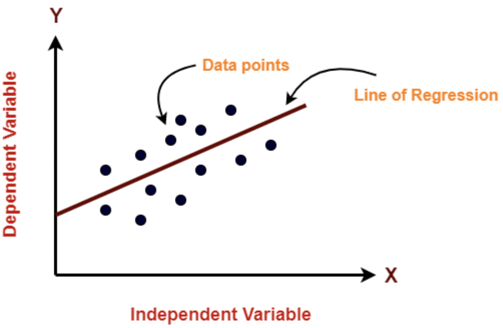

7.  Метод градиентного спуска для парной линейной регрессии.
    ========================================================
    

Метод градиентного спуска — это способ нахождения локального минимума функции в процессе движения в направлении антиградиента. Он был предложен Огюстеном Луи Коши еще в 1847 году.

С сайта коротеева:

Таким образом, у нас есть наша функция гипотезы, и у нас есть способ оценить, насколько хорошо конкретная гипотеза вписывается в данные. Теперь нам нужно подобрать параметры в функции гипотезы. Вот где приходит на помощь метод градиентного спуска.

Представьте себе, что мы нарисуем нашу функцию гипотезы на основе ее параметров b0 и b1 (фактически мы представляем график функции стоимости как функцию оценок параметров).

Отложим b0 на оси x и b1 на оси y, с функцией стоимости на вертикальной оси z. Точки на нашем графике будут результатом функции стоимости, используя нашу гипотезу с этими конкретными параметрами.

Мы будем знать, что нам удалось подобрать оптимальные параметры, когда наша функция стоимости находится в самом низу на нашем графике, то есть когда ее значение является минимальным.

То, как мы это делаем - это используя производную (касательную линию к функции) нашей функции стоимости. Наклон касательной является производной в этой точке, и это даст нам направление движения в сторону самого крутого уменьшения значения функции. Мы делаем шаги вниз по функции стоимости в направлении с самым крутым спусками, а размер каждого шага определяется параметром α, который называется скоростью обучения.

Алгоритм градиентного спуска:

повторяйте до сходимости:

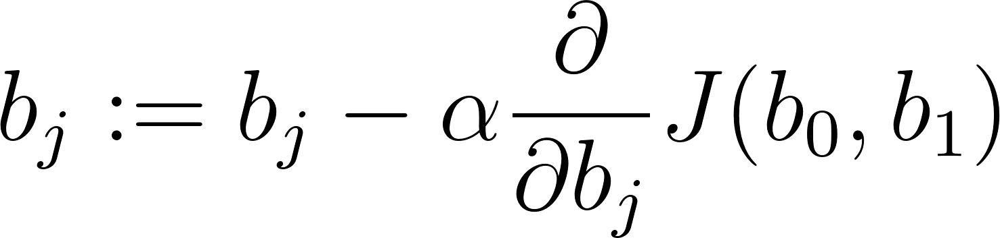

где j=0,1 - представляет собой индекс номера признака.

8.  Понятие функции ошибки: требования, использование, примеры.
    ===========================================================
    

Мы можем измерить точность нашей функции гипотезы, используя функцию ошибки. Для этого требуется средняя (фактически чуть усложненная версия среднего арифметического) всех результатов вычисления гипотезы с входами x по сравнению с фактическим выходом y.

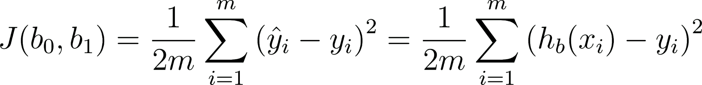

По сути своей, это половина среднего квадрата разницы между прогнозируемым и фактическим значением выходной переменной.

Эту функцию называют «функцией квадрата ошибки» или «среднеквадратичной ошибкой» (mean squared error, MSE). Среднее значение уменьшено вдвое для удобства вычисления градиентного спуска, так как производная квадратичной функции будет отменять множитель 1/2.

Теперь мы можем конкретно измерить точность нашей предсказывающей функции по сравнению с правильными результатами, которые мы имеем, чтобы мы могли предсказать новые результаты, которых у нас нет.

Если мы попытаемся представить это наглядно, наш набор данных обучения будет разбросан по плоскости x-y. Мы пытаемся подобрать прямую линию, которая проходит через этот разбросанный набор данных. Наша цель - получить наилучшую возможную линию. Лучшая линия будет такой, чтобы средние квадраты вертикальных расстояний рассеянных точек от линии были наименьшими. В лучшем случае линия должна проходить через все точки нашего набора данных обучения. В таком случае значение J будет равно 0.

9.  Множественная и нелинейная регрессии.
    =====================================
    

Множественная регрессия
-----------------------

Линейная регрессия с несколькими переменными также известна как «множественная линейная регрессия». Введем обозначения для уравнений, где мы можем иметь любое количество входных переменных:

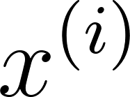 - вектор-столбец всех значений признаков i-го обучающего примера;

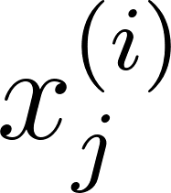 - значение j-го признака i-го обучающего примера;

m - количество примеров в обучающей выборке;

n - количество признаков;

X - матрица признаков;

b - вектор параметров регрессии.

Заметим, что в будущем для удобства примем, что 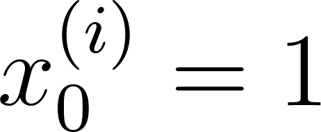 для всех i. Другими словами, мы для удобства введем некий суррогатный признак, для всех наблюдений равный единице. это сильно упростит математические выкладки, особенно в матричной форме.

Теперь определим множественную форму функции гипотезы следующим образом, используя несколько признаков:

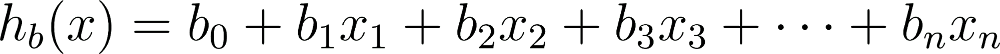

Используя определение матричного умножения, наша многопараметрическая функция гипотезы может быть кратко представлена в виде: h(x) = B X.

### Функция ошибки

Для множественной регрессии функция ошибки от вектора параметров b выглядит следующим образом:

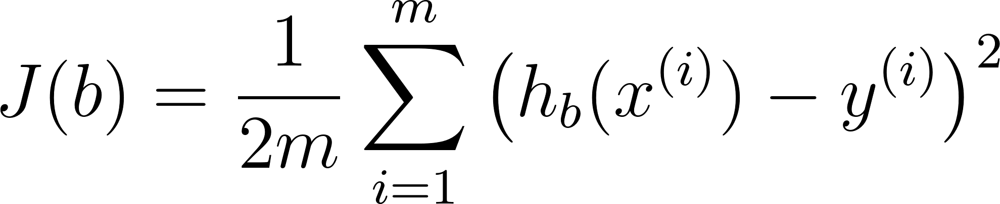

Или в матричной форме:

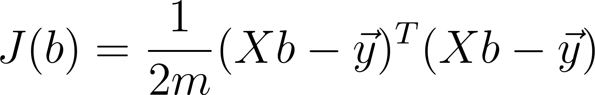

Метод градиентного спуска для множественной регрессии определяется следующими уравнениями:

повторять до сходимости:

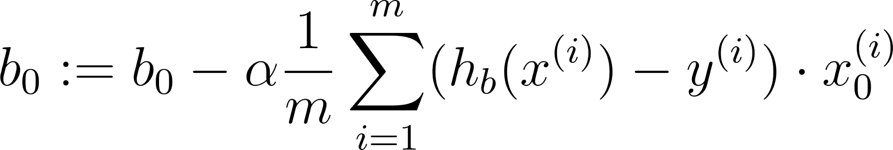

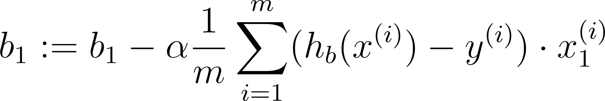

Или в матричной форме:

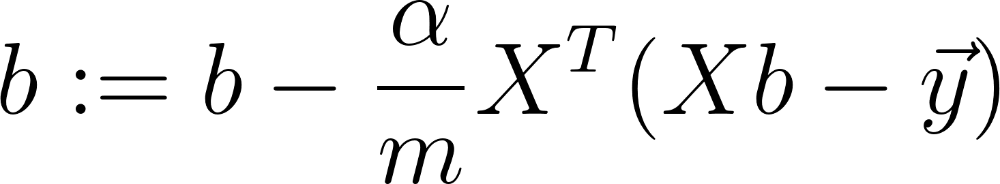

Полиномиальная регрессия
------------------------

Наша функция гипотезы не обязательно должна быть линейной (прямой), если это не соответствует данным.

Мы можем изменить поведение или кривую нашей функции гипотезы, сделав ее квадратичной, кубической или квадратной корневой функцией (или любой другой формой).

Например, если наша функция гипотезы 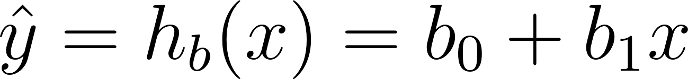, то мы можем добавить еще один признак, основанный на x1, получив квадратичную функцию 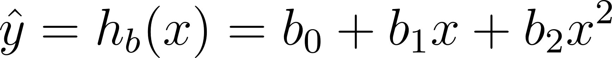 или кубическую функцию 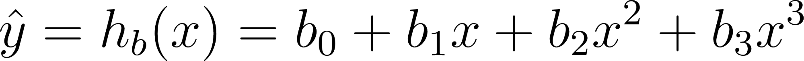. В кубической функции мы по сути ввели два новых признака: 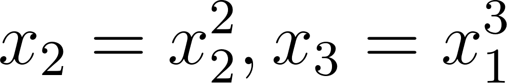. Точно таким же образом, мы можем создать, например, такую функцию: 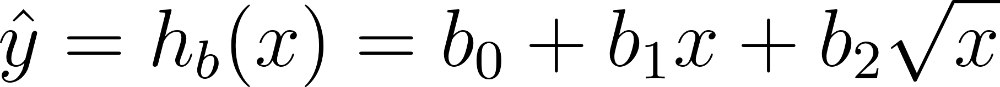.

Одна важная вещь, о которой следует помнить, заключается в том, что если вы выбираете свои функции таким образом, масштабирование признаков становится очень важным. Например, если x имеет диапазон 1 - 1000, тогда диапазон x2 становится 1 - 1000000, а диапазон x3 становится 1 - 1000000000.

### Нормальное уравнение

«Нормальное уравнение» - это метод нахождения оптимальных параметров регрессии без итераций:

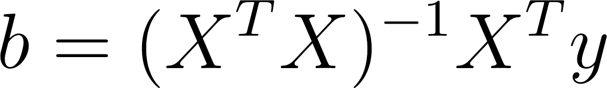

Нет необходимости выполнять масштабирование признаков, если мы решаем регрессию с помощью нормального уравнения.

Метод решения через нормальное уравнение имеет ряд преимуществ по сравнению с методом градиентного спуска:

1.  Нет необходимости в нормализации признаков;
2.  Не нужно выбирать скорость обучения;
3.  Не требует вычисления частных производных функции ошибки;

Однако, у него есть и недостатки:

1.  Имеет асимптотику O(n3) по сравнению с O(n2) у градиентного спуска. Поэтому довольно медленно работает при больших n.
2.  Требует вычисления обратной матрицы. В некоторых случаях матрица 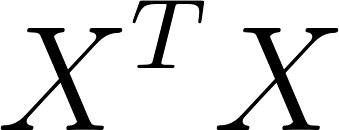 может быть вырожденной, что затруднит использование нормального уравнения.

10.  Нормализация признаков в задачах регрессии.
    ===========================================
    

Мы можем ускорить сходимость метода градиентного спуска, получив каждое из наших входных значений примерно в том же диапазоне. Это связано с тем, что b будет быстро сходиться на малых диапазонах и медленно на больших диапазонах, и поэтому будет колебаться неэффективно до оптимального, если переменные очень неравномерны.

Способ предотвратить это - изменить диапазоны наших входных переменных, чтобы они были примерно одинаковыми. В идеале

\-1 ≤ x ≤ 1 или же -0,5 ≤ x ≤ 0,5.

Это не точные требования; мы только пытаемся ускорить процесс. Цель состоит в том, чтобы получить все входные переменные в примерно один из этих диапазонов, дать или взять несколько.

Два метода для этого - масштабирование признаков и нормализация по среднему. Масштабирование признаков заключается в делении входных значений на размах выборки (то есть максимальное значение минус минимальное значение) входной переменной, в результате чего новый диапазон составляет всего 1. Нормализация по среднему включает в себя вычитание среднего значения входной переменной из значений для этой входной переменной, в результате чего новое среднее значение для этой переменной равно нулю. Чтобы реализовать оба этих метода, отрегулируйте свои входные значения, как показано в этой формуле:

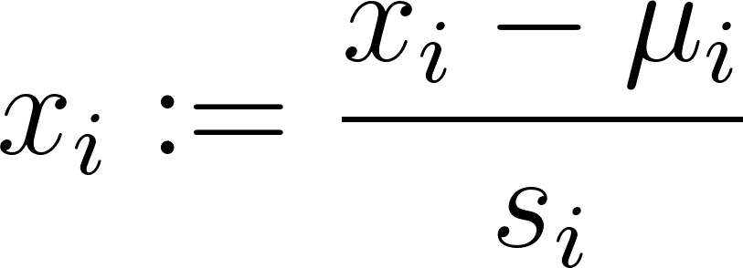

Где  - среднее значение признака i, а  - стандартное отклонение этого признака.

11.  Задача классификации: постановка, математическая формализация.
    ==============================================================
    

Классификацией называется процедура, в которой объекты распределяются по группам (классам) в соответствии с численными значениями их переменных, характеризующими свойства этих объектов. Исходными данными для классификации является матрица X, в которой каждая строка представляет один объект, а каждый столбец – одну из переменных. Эта матрица называется исходным набором данных.

Классификацией называют не только саму процедуру распределения, но и ее результат. Употребляется также термин распознавание образов (pattern recognition) , который можно считать синонимом. В математической статистике классификацию часто называют дискриминацией.

Метод (алгоритм), которым проводят классификацию, называют классификатором. Классификатор переводит  вектор признаков объекта x в целое число, 1, 2, … , соответствующее номеру класса, в который он помещает этот объект.

Если для всех объектов исходного набора известно, к какому классу они принадлежат, то такая постановка задачи называется классификацией с учителем (или с обучением). Обучение без учителя происходит тогда, когда принадлежность объектов в исходном наборе нам заранее не известна.

Первым делом следует очистить датасет от ненужных данных - построить корреляционную матрицу, проанализировать зависимости и удалить ненужные столбцы данных. Затем делим на тестовую и обучающую выборки и строим модели, например -

Модель логистической регрессии,

Метод опорных векторов (support vector machines, SVM) является еще одним типом алгоритма машинного обучения с учителем для задач классификации. Иногда он работает быстрее и точнее логистической регрессии.

Метод К-ближайший соседей и другие. Анализируем, какая модель показала себя лучше всего и делаем вывод.

Так же Задача классификации — это задача присвоения меток объектам. Например, если объекты — это фотографии, то метками может быть содержание фотографий: содержит ли изображение пешехода или нет, изображен ли мужчина или женщина, какой породы собака изображена на фотографии. Обычно есть набор взаимоисключающих меток и сборник объектов, для которых эти метки известны. Имея такую коллекцию данных необходимо автоматически расставлять метки на произвольных объектах того же типа, что были в изначальной коллекции.

12.  Метод градиентного спуска для задач классификации.
    ==================================================
    

В машинном обучении градиентный спуск – это алгоритм оптимизации, способный находить наиболее подходящие решения для широкого круга проблем. Он работает через повторение настройки параметров для минимизации функции стоимости.

Самым важным параметром этого алгоритма является размер шагов, который определяется скоростью обучения. Если скорость обучения очень низкая, алгоритм будет проходить множество итераций, чтобы сойтись, что в конечном итоге займет очень много времени.

Но если скорость обучения очень высока, он разделит алгоритм на большие значения, что поможет найти хорошее решение. При использовании алгоритма градиентного спуска необходимо убедиться, что все функции имеют одинаковый масштаб, в противном случае потребуется много времени, чтобы сойтись.

Типы алгоритмов градиентного спуска
-----------------------------------

Чтобы реализовать алгоритм градиентного спуска, нам необходимо вычислить градиент функции стоимости, что приводит к трем типам алгоритмов градиентного спуска, которые различаются объемом данных, используемых для вычисления градиента функции стоимости.

Пакетный градиентный спуск:
---------------------------

Он использует весь пакет данных на каждом этапе итерации, в результате довольно медленно обрабатывает большие наборы обучающих данных. Это предпочтительнее, только если вы хотите обработать все экземпляры в обучающем наборе. Единственное ограничение заключается в том, что если обучающий набор очень велик, он будет очень медленным. Давайте посмотрим, как реализовать его с помощью Python:

Стохастический градиентный спуск:
-----------------------------------

Итак, как упоминалось выше, пакетный градиентный спуск работает очень медленно, поскольку он использует все обучающие данные для вычисления градиентов на каждом этапе итерации. Это ограничение преодолевается с помощью алгоритма стохастического градиентного спуска.

SGD извлекает случайный экземпляр обучающего набора на каждом шаге итерации и вычисляет градиенты на основе этого случайного экземпляра. Таким образом, работа с одним экземпляром идет быстрее. Теперь давайте посмотрим, как реализовать это с помощью Python:

Мини-пакетный градиентный спуск:
----------------------------------

Последний тип алгоритма градиентного спуска – это мини-пакетный градиентный спуск. Он вычисляет градиенты для небольших случайных наборов экземпляров, известных как мини-пакеты, вместо вычисления набора обучающих данных или одного случайного экземпляра. Теперь давайте посмотрим, как реализовать это с помощью Python:

Итог
----

Таким образом, градиентный спуск – это общий метод оптимизации, способный находить самые подходящие решения для широкого круга задач. Например, предположим, что вы заблудились в горах в плотном тумане и в этот момент вы можете чувствовать только наклон земли под ногами. На этом этапе хорошей стратегией для прохода на дно долины является спуск в направлении самого крутого склона. Таким же образом работают алгоритмы градиентного спуска.

13.  Логистическая регрессия в задачах классификации.
    ================================================
    

Логистическая регрессия, как и линейная, была заимствована из статистики. Отличительной чертой логистической регрессии является то, что значением функции является вероятность. Вероятность чего? Закономерный вопрос. Давайте обо всем по порядку.

На входе логистическая регрессия, как и линейная, принимает одну или несколько независимых переменных (признаков набора данных) и подсчитывает их взаимосвязь с зависимой переменной. Различие в том, что логистическая регрессия применяет сигмоидную функцию (также известна как логистическая, или логит-функция), которая позволяет предсказывать непрерывную переменную со значениями на отрезке \[0, 1\] при любых значениях независимых переменных. Фактически это распределение Бернулли (для тех, кому это интересно).

Теперь наступает время ответить на вопросы, поставленные выше.

Логистическая регрессия вычисляет вероятность того, что данное исходное значение принадлежит к определенному классу. Она используется для задач классификации: оценивает апостериорные вероятности принадлежности данного объекта к тому или иному классу.

Для оценки модели логистическая регрессия применяет метод максимального правдоподобия. Он основан на предположении о том, что вся информация о статистической выборке содержится в функции правдоподобия. Попытаемся «на пальцах» сформулировать его принцип действия. Цель метода – оценить параметры распределения вероятностей. Способ – максимизировать функцию правдоподобия. Эта функция как раз определяет вероятность значений параметров регрессионной модели для заданного значения независимой переменной x=X:

P(θ)=P(x=X|θ),

где θ — значение параметра модели, P(θ) — вероятность появления значения θ, X — значение независимой переменной x, для которого определяется условная вероятность θ.

Задача заключается в поиске таких значений параметров Θ = (θ1, θ2,...,θn), которые максимизируют функцию правдоподобия L(x|Θ). Для этого определяются оценки максимального правдоподобия (maximum likelihood estimates), для которых значения параметров являются наиболее «правдоподобными» по отношению к наблюдаемым данным.

14.  Множественная и многоклассовая классификация. Алгоритм “один против всех”.
    ==========================================================================
    

Множественная классификация:

Теперь мы рассмотрим классификацию данных более чем в двух категориях. Вместо y = {0,1} мы расширим наше определение так, чтобы y = {0,1 ... n}.

В этом случае мы делим нашу задачу на n + 1 (+1, потому что индекс начинается с 0) двоичных задач классификации; в каждом из них мы прогнозируем вероятность того, что 'y' является членом одного из наших классов.

Многоклассовая классификация:

Это - задача классификации с более чем двумя классами. Каждый образец можно пометить только как один класс.

Например, классификация с использованием признаков, извлеченных из набора изображений фруктов, где каждое изображение может быть апельсином, яблоком или грушей. Каждое изображение представляет собой один образец и помечен как один из 3 возможных классов.

Метод Один против Всех:

Это - модель, которая предоставляет путь решения бинарной классификации из нескольких возможных решений. В течение обучения модель проходит через последовательность бинарных классификаторов (по одному бинарному классификатору для каждого возможного выхода), тренируя каждый их них отвечать на отдельный классификационный вопрос.Метод "один против всех" является частным случаем (методом с диагональной кодовой матрицей и несколько более сложной процедурой декодирования).

15.  Метод опорных векторов в задачах классификации.
    ===============================================
    

Задача классификации состоит в определении к какому классу из, как минимум, двух изначально известных относится данный объект. Обычно таким объектом является вектор в n-мерном вещественном пространстве . Координаты вектора описывают отдельные атрибуты объекта.

Метод опорных векторов (англ. support vector machine, SVM) — один из наиболее популярных методов обучения, линейный алгоритм, который применяется для решения задач классификации и регрессии. Основная идея метода заключается в построении гиперплоскости, разделяющей объекты выборки оптимальным способом. Алгоритм работает в предположении, что чем больше расстояние (зазор) между разделяющей гиперплоскостью и объектами разделяемых классов, тем меньше будет средняя ошибка классификатора. SVM — алгоритм обучения с учителем.

Теория

Основной задачей алгоритма является найти наиболее правильную линию, или гиперплоскость разделяющую данные на два класса. SVM это алгоритм, который получает на входе данные, и возвращает такую разделяющую линию.

Как SVM находит лучшую линию

Алгоритм SVM устроен таким образом, что он ищет точки на графике, которые расположены непосредственно к линии разделения ближе всего. Эти точки называются опорными векторами. Затем, алгоритм вычисляет расстояние между опорными векторами и разделяющей плоскостью. Это расстояние которое называется зазором. Основная цель алгоритма — максимизировать расстояние зазора. Лучшей гиперплоскостью считается такая гиперплоскость, для которой этот зазор является максимально большим.

Данный метод изначально относится к бинарным классификаторам, хотя существуют способы заставить его работать и для задач мульти-классификации.

Пусть имеется обучающая выборка: 

Метод опорных векторов строит классифицирующую функцию F в виде , где  — скалярное произведение, w — нормальный вектор к разделяющей гиперплоскости,b — вспомогательный параметр. Те объекты, для которых F(x) = 1 попадают в один класс, а объекты с F(x) = -1 — в другой. Выбор именно такой функции не случаен: любая гиперплоскость может быть задана в виде  для некоторых w и b.

Далее, мы хотим выбрать такие w и b которые максимизируют расстояние до каждого класса. Можно подсчитать, что данное расстояние равно . Проблема нахождения максимума  эквивалентна проблеме нахождения минимума . Запишем все это в виде задачи оптимизации:

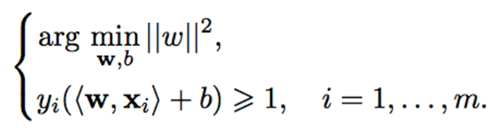

которая является стандартной задачей квадратичного программирования и решается с помощью множителей Лагранжа

Линейная неразделимость

На практике случаи, когда данные можно разделить гиперплоскостью, или, как еще говорят, линейно, довольно редки.

В этом случае поступают так: все элементы обучающей выборки вкладываются в пространство X более высокой размерности с помощью специального отображения . При этом отображение  выбирается так, чтобы в новом пространстве X выборка была линейно разделима.

Классифицирующая функция F принимает вид 

16.  Понятие ядра и виды ядер в методе опорных векторов.
    ===================================================
    

Ядра (kernels) позволяют нам создавать сложные нелинейные классификаторы с использованием метода опорных векторов.

Виды ядер:

Линейное ядро — это аналог применения линейных преобразований к пространству объектов.

Полиномиальные ядра - вы проецируете исходное пространство объектов в полиномиальное. Граница, разделяющая классы, определяется полиномом более высокого порядка.

Гауссовское ядро (RBF) - это функция, значение которой зависит от расстояния до начала координат или от некоторой точки.

Использование ядер не является исключительным для SVM и может также применяться к логистической регрессии. Однако из-за вычислительной оптимизации в алгоритмах SVM,  ядра работают с SVM, намного быстрее, чем с другими алгоритмами, поэтому ядра почти всегда встречаются вместе только с SVM.

17.  Метод решающих деревьев в задачах классификации.
    ================================================
    

* Дерево решений - это граф, в узлах которого содержатся некоторые условия (как правило, пороговые условия по признаку)

* Деревья решений являются одним из самых популярных методов классического машинного обучения.

* Используются как для построения модели, так и для предварительного анализа данных.

* Дерево решений просто построить, ему не требуются огромные вычислительные мощности.

* Деревья решений - интерпретируемый метод, его можно объяснить и понять, особенно при малых глубинах дерева.
* Деревья решений более лояльны к входным данным - могут работать с категориальными признаками.

* Деревья решений склонны к переобучению при достаточно больших глубинах.

* Дерево решений очень толерантно к лишним признакам в наборе данных.

* Существуют специальные виды распределений, которые сложно описываются деревьями решений.

from sklearn.tree import plot\_tree

plt.figure(figsize=(12, 9))

plot\_tree(clf)

Деревья решений являются классом очень эффективной модели машинного обучения, позволяющей получить высокую точность в решении многих задач, сохраняя при этом высокий уровень интерпретации. Четкость представления информации делает деревья решений особенными среди других моделей машинного обучения. Освоенные деревом решений «знания» напрямую формируются в иерархическую структуру, которая хранит и представляет знания в понятном даже для неспециалистов виде.

Деревья решений в машинном обучении

Модели дерева решений строятся в два этапа: индукция и отсечение. Индукция — это то, где мы строим дерево, то есть устанавливаем все границы иерархического решения, основываясь на наших данных. Из-за своего характера обучаемые деревья решений могут быть подвержены значительному переобучению. Отсечение — это процесс удаления ненужной структуры из дерева решений, эффективно упрощая его для понимания и избегания переобучения.

Индукция дерева решений проходит 4 главных этапа построения:

* Начните с обучающего набора данных, в котором должны содержаться признаки переменных и результаты классификации или регрессии.

* Определите «лучший признак » в наборе данных для их разбиения. О том, как определить этот «лучший признак » поговорим позже.

* Разбейте данные на подмножества, которые будут содержать возможные значения для лучшего признака. Такое разбиение в основном определяет узел на дереве, то есть каждый узел — это разделенная точка, основанная на определенном признаке из наших данных.

* Рекурсивно сгенерируйте новые узлы дерева с помощью подмножества данных, созданных на 3 этапе. Продолжайте разбиение до тех пор, пока не достигните точки, на которой будет находится оптимизированная каким-то способом максимальная точность. Старайтесь минимизировать количество разбиений и узлов.

18.  Метод k ближайших соседей в задачах классификации.
    ==================================================
    

Метод k-ближайших соседей (k-nearest neighbors/KNN) – алгоритм машинного обучения с учителем, который используется в решении задач классификации. Основной смысл в том, что алгоритм классифицирует объект и относит его к классу, которому принадлежит большинство из его соседей, т. е. k ближайших объектов обучающей выборки.

Как работает KNN:

Данный алгоритм требователен к нормализации данных, когда значения расстояния могут сильно зависеть от атрибутов с большими диапазонами, применяют minmax-нормализация или z-нормализация.

MinMax:

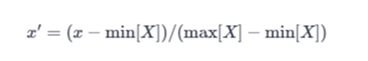

Z:

Основой алгоритма является евклидово расстояние, которое рассчитывает расстояние между двумя точками по теореме Пифагора (вычисляется наименьшее расстояние между двумя точками)

Очень важным является выбор значения параметра k для получения корректных результатов, если выбрать маленькое k, то будет возникать эффект переобучения. Если выбрать k=1, то метод ближайших соседей будет присваивать новому объекту метку класса ближайшего к нему объекта. В случае, когда значение выбрано слишком большое, при классификации будет приниматься много объектов, что приведет к плохой выраженности границ классов.

Задачи, решаемые данным методом:

*    Классификация машин по виду модели/скорости
*   Классификация клиентов по их физическим данным
*   Классификация животных по видам

Преимущества алгоритма:

*   Простая реализация
*   Высокая точность
*   Устойчивость к аномальным значениям

Недостатки алгоритма:

*   Затраты в вычислениях, их-за необходимости вычисления расстояний до каждого объекта выборки.
*   Необходимость хранить обучающую выборку целиком

19.  Однослойный перцептрон в задачах классификации.
    ===============================================
    

В основе персептрона лежит математическая модель восприятия информации мозгом. Разные исследователи по-разному его определяют. В самом общем своем виде (как его описывал Розенблатт) он представляет систему из элементов трех разных типов: сенсоров, ассоциативных элементов и реагирующих элементов.

Рассмотрим принцип работы персептрона.

●        Первыми в работу включаются S-элементы. Они могут находиться либо в состоянии покоя (сигнал равен 0), либо в состоянии возбуждения (сигнал равен 1).

●        Далее сигналы от S-элементов передаются A-элементам по так называемым S-A связям. Эти связи могут иметь веса, равные только -1, 0 или 1.

●        Затем сигналы от сенсорных элементов, прошедших по S-A связям попадают в A-элементы, которые еще называют ассоциативными элементами. Стоит заметить, что одному A-элементу может соответствовать несколько S-элементов. Если сигналы, поступившие на A-элемент, в совокупности превышают некоторый его порог θ, то этот A-элемент возбуждается и выдает сигнал, равный 1. В противном случае (сигнал от S-элементов не превысил порога A-элемента), генерируется нулевой сигнал.

Почему A-элементы назвали ассоциативными? Дело в том, что A-элементы являются агрегаторами сигналов от сенсорных элементов. Например, у нас есть группа сенсоров, каждый из которых распознает кусок буквы «Д» на исследуемой картинке. Однако только их совокупность (то есть когда несколько сенсоров выдали сигнал, равный 1) может возбудить A-элемент целиком. На другие буквы А-элемент не реагирует, только на букву «Д». То есть он ассоциируется с буквой «Д». Отсюда и такое название.

Можно привести  и другой пример. На самом деле ваши глаза состоят из невероятного количества S-элементов (сенсоров), улавливающих падающий свет (около 140 000 000). И у вас какой-то A-элемент, который распознает конкретную часть лица. И вот вы увидели на улице человека. Некоторые A-элементы, которые распознали конкретные части лица, возбуждаются.

Далее сигналы, которые произвели возбужденные A-элементы, направляются к сумматору (R-элемент), действие которого вам уже известно. Однако, чтобы добраться до R-элемента, они проходят по A-R связям, у которых тоже есть веса. Однако здесь они уже могут принимать любые значения (в отличие от S-A связей).

Финальный аккорд. R-элемент складывает друг с другом взвешенные сигналы от A-элементов и, если превышен определенный порог, генерирует выходной сигнал, равный 1. Это означает, что в общем потоке информации от глаз мы распознали лицо человека.

Если порог не превышен, то выход персептрона равен -1. То есть мы не выделили лицо из общего потока информации.

Так как R-элемент определяет выход персептрона в целом, его назвали реагирующим.

Однослойный персептрон

Его ключевая особенность состоит в том, что каждый S-элемент однозначно соответствует одному A-элементу, все S-A связи имеют вес, равный +1, а порог A элементов равен 1.

20.  Метрики эффективности и функции ошибки: назначение, примеры, различия.
    ======================================================================
    

Метрики эффективности

При классификации на два класса (по сути да/нет) у нас есть 4 различных исхода:

* True Positive (TP) — истинное значение было "да" и мы предсказали "да"

* True Negatives (TN) — истинное значение было "нет" и мы предсказали "нет"

* False Positive (FP) — истинное значение было "нет", а мы предсказали "да". Ложное срабатывание, ошибка I рода.
* False Negatives (FN) — истинное значение было "да", а мы предсказали "нет". Пропуск цели, ошибка II рода. (ред.)

Также есть следующие метрики:

* Accuracy (аккуратность) - процент верных предсказаний

* Precision (точность) - сколько верных среди предсказанных как "Класс 1/да"

* Recall (полнота) - сколько из настоящих "Класс 1/да" мы определили верно (то же самое, что True Positive Rate, Sensitivity)

* F-мера (гармоническое среднее P и R)
* Log-loss (учитывает значение вероятности) (ред.)

При регрессии у нас работают другие метрики:

Общая идея: насколько хорошо вписывается в данные линия регрессии. Например, как далеко вокруг неё разбросаны все наблюдения:

* MAE/MAD (Mean Absolute Error, Mean Absolute Deviation) - средний модуль ошибки

* MSE/MSD (Mean Squared Error/Deviation) - среднеквадратическая ошибка

* RMSE/RMSD (Root Mean Squared Error) - лучше, чем MSE, потому что выражается в тех же единицах, что и измеряемая величина

MAPE/MAPD (Mean Absolute Percentage Error) - ошибка в процентах от самой величины

Функция ошибки

Чтобы оценить ML-алгоритм (параметры модели), нужно вычислить, насколько результат его работы далек от ожидаемого. Эту задачу решает функция потерь (Loss/ функция ошибки). Она определяет расстояние между фактическим выходом алгоритма и ожидаемым. Чем меньше результат, который выдает функция потерь, тем лучше. ​​Функции потерь не являются фиксированными, они меняются в зависимости от поставленной задачи и цели, которую необходимо достичь. Функция потерь возникает в тот момент, когда мы сводим задачу построения модели к задаче оптимизации.

Для парной линейной регрессии:

, где  - параметры,  - гипотеза, цель: 

По сути своей, это половина среднего квадрата разницы между прогнозируемым и фактическим значением выходной переменной.

Эту функцию называют «функцией квадрата ошибки» или «среднеквадратичной ошибкой» (mean squared error, MSE). Среднее значение уменьшено вдвое для удобства вычисления градиентного спуска, так как производная квадратичной функции будет отменять множитель 1/2.

Для множественной регрессии функция ошибки от вектора параметров b  в матричной форме выглядит следующим образом:

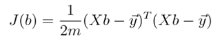

гипотеза: 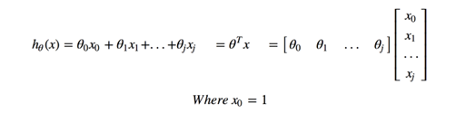

Логистическая регрессия

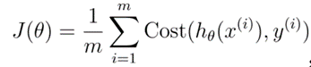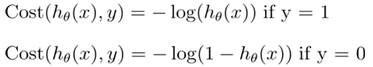

Accuracy (доля правильных ответов):

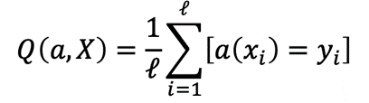

Выбор функции ошибки

*   Среднеквадратичная ошибка (MSE) (он же L2 Loss).Данный метод расчёта в значительной мере чувствителен к выбросам в выборке, или к выборкам где разброс значений очень большой. В основном, данная функция применяется для переменных, распределение которых близко к распределению Гаусса.
*   Средняя абсолютная ошибка (MAE) (он же L1 Loss) – это усреднённая сумма модулей разницы между реальным и предсказанным значениями. MAE во многом похожа на MSE, но она отличается меньшей чувствительностью к выбросам значений (так как не берётся квадрат отклонения).
*   Среднеквадратичная логарифмическая ошибка (MSLE) – усреднённая сумма квадратов разностей между логарифмами значений. Благодаря большому гасящему эффекту логарифма она более применима к моделям, строящимся на данных, которые имеют большой разброс значений на несколько порядков.

21.  Понятие набора данных (датасета) в машинном обучении. Требования, представление. Признаки и объекты.
    ====================================================================================================
    

Набор данных (датасет) – это структурированная информация, представленная в табличном виде.

При этом строки такой таблицы называются объектами, а столбцы – признаками.

Признаки - это некоторые характеристики объекта (не обязательно числовые).

Объект - это экземпляр некоторой сущности, которую мы изучаем.

Например:

При изучение успеваемости студентов нашими объектами будут являться сами студенты, которые в свою очередь имеют признаки такие как Имя, Возраст, Оценка по математике и так далее.

Качество и релевантность набора данных напрямую влияет на эффективность обученной системы. Другими словами, если у вас плохой, недостаточный, нерелевантный набор данных, в них есть пропуски, выбросы, систематические ошибки - то уже совершенно неважно, насколько хорошую модель вы используете, все равно на выходе получится неэффективная система. Модели подстраиваются под данные, поэтому обработка данных, их анализ, сбор, очистка - это очень важные части технологий машинного обучения.

22.  Шкалы измерения признаков. Виды шкал, их характеристика.
    ========================================================
    

На первоначальном этапе знакомства с набором данных для подготовки к обучению моделей очень важно понимать шкалы, по которым измеряется каждый фактор. Принципиальное различие в методах работы с категориальными и числовыми, дискретными и непрерывными признаками обосновывает необходимость получить эту информацию как можно раньше.

Шкалы:

*   Категориальная шкала - это шкала измерения, которая используется для идентификации. Она присваивает номера атрибутам для удобства идентификации, но может использоваться только как метка.
*   Порядковая шкала - предполагает ранжирование (упорядочивание) значений переменной в зависимости от масштабирования. Атрибуты в порядковой шкале обычно располагаются в порядке возрастания или убывания. Она использует квалификаторы, такие как «очень», «высоко», «больше», «меньше» и т. д.
*   Целочисленная шкала (шкала интервалов) - это шкала, в которой уровни упорядочены, а интервалы между ними равны. Целочисленная шкала не только позволяет однозначно определить, какое значение больше (меньше), но и на сколько.
*   Абсолютная шкала (шкала отношений) - является «наивысшим» уровнем представления данных. Эта шкала отличается от целочисленной шкалы только тем, что в ней строго определено положение нулевой точки. Благодаря этому шкала отношений не накладывает никаких ограничений на математический аппарат, используемый для обработки результатов наблюдений.

23.  Понятие чистых данных. Определение, очистка данных.
    ===================================================
    

Определение чистых данных (tidy data):
* Каждая переменная соответствует колонке

*  Каждое измерение соответствует строке

*  Каждая таблица\\файл содержит данные об одном виде наблюдений\\экспериментов

Одна из самых распространенных проблем в данных, использующихся в машинном обучении - наличие отсутствующих измерений. Данные с пропусками нельзя без предварительной обработки подавать на вход почти никаких обучаемых моделей, поэтому практически непременным этапом предварительного анализа данных является выявление отсутствующих значений. Главным образом цель этого метода - выявить лучший подход к избавлению от пропущенных значений.

Основные задачи:

* Выбор стратегии борьбы с пропущенными данными.

Основные методы борьбы с пропусками значений

* Удаление признака

* Удаление объекта

* Заполнение средним значением

* Заполнение медианным, модальным, средним по логарифмической шкале
* Заполнение групповым средним
* Заполнение специальным значением

* Заполнение случайным значением

* Введение нового признака

24.  Основные этапы проекта по машинному обучению.
    =============================================
    

Жизненный цикл модели машинного обучения (ML) – это процесс, охватывающий сразу от идентификации исходных данных до разработки модели, развертывания модели и обслуживания модели. На высоком уровне вся деятельность подпадает под две широкие категории, такие как разработка моделей машинного обучения и операции с моделями машинного обучения.

Шаги жизненного цикла разработки модели машинного обучения можно в целом разделить на следующие:

1.  исследование данных
2.  построение модели
3.  настройка гиперпараметров модели
4.  выбор модели с оптимальной производительностью.

Исследовательский анализ данных – важный шаг, который начинается после того, как бизнес-гипотеза готова. Исследовательский анализ данных включает идентификацию атрибутов данных, предварительную обработку данных и проектирование функций. Идентификация атрибутов включает в себя классификацию функций на категориальные и непрерывные переменные, что помогает в применении соответствующей обработки, чтобы быть задается переменной алгоритмом при построении модели.

Предварительная обработка данных включает в себя идентификацию недостающих значений и выбросов и заполнение этих пробелов путем вычисления среднего значения для количественных атрибутов и режима для качественных атрибутов данных для повышения предварительной силы модели.

Функциональная инженерия – это следующий по важности шаг в исследовательском анализе данных, когда необработанный набор данных обрабатывается для преобразования типов данных строковых, datetime или числовых в числовые векторы для алгоритма машинного обучения для понимания и построения эффективной модели прогнозирования.

В качестве последнего шага необходимо выбрать соответствующие функции, которые помогают повысить точность модели, с помощью таких методов, как одномерный выбор, важность функции и матрица корреляции . Эти методы обнаруживают коллинеарность между двумя переменными, где они сильно коррелированы и содержат аналогичную информацию о дисперсии в пределах данного набора данных.

Построение модели машинного обучения требует разделения данных на два набора, такие как «обучающий набор» и «набор для тестирования».

Вычисление производительности модели является следующим логическим шагом для выбора правильной модели. Показатели производительности модели будут определять окончательный выбор модели, которые включают вычисление точности, точности, отзыва, оценки F1 (средневзвешенное значение точности и отзыва), а также матрицу путаницы для моделей классификации и коэффициент определения для регрессионных моделей.

Настройка гиперпараметров модели является настоятельно рекомендуемым шагом в этом процессе, продолжайте, пока производительность модели не достигнет примерно 80-85%. Рекомендуется использовать метод поиска по сетке для поиска оптимальных гиперпараметров модели, что приводит к наиболее “точным” прогнозам. Кроме того, также рекомендуется выполнить перекрестную проверку, так как иногда повышение точности модели может быть связано с переоснащением (слишком чувствительная модель, неспособная к обобщению) или недостаточной подгонкой (очень обобщенная модель) модели с использованием метода перекрестной проверки k-кратной. Чтобы избежать переоснащения, увеличьте размер выборки обучающих данных, чтобы ввести больше шаблонов, или уменьшите количество функций, чтобы избежать сложности.

Выберите модель с оптимальной производительностью.

25.  Предварительный анализ данных: задачи, методы, цели.
    ====================================================
    

В ходе предварительного анализа определяют соответствие имеющихся данных требованиям, предъявляемым к ним математическими методами (объективности, сопоставимости, полноты, однородности и устойчивости).

Подготовка данных для машинного обучения начинается с исследовательского анализа данных. В результате выявляют параметры данных, закономерности, ошибки, аномалии и пропуски.

В зависимости от качества и формата исходных данных на этапе предварительной обработки стоят следующие задачи:

1\. Очистить данные.

При очистке данных удаляют устаревшие данные, дубликаты, аномалии, пропуски и ошибки. Но не всегда можно просто убрать все некачественные данные. Иногда их так много, что удаление повлияет на результаты машинного обучения, поэтому данные придётся редактировать.

2\. Редактировать данные.

Данные могут быть записаны с ошибками или в разных форматах, поэтому их нужно корректировать. Например, в таблице может быть по-разному указано название одного и того же населённого пункта: «посёлок Заозёрный», «п. Заозёрный», «пос. Заозёрный», «поселок Заозерный». Модель будет воспринимать эти названия как разные значения, поэтому придётся привести записи к одному формату. Что касается числовых данных, то, чтобы привести их к единому формату, например, можно преобразовать значения в диапазон от 0 до 1.

3\. Заполнить пропуски.

В работе с пропусками есть разные подходы, их выбор зависит от видов и источников данных. Пропуски можно заполнить наиболее вероятным значением. Числовые показатели можно заменить, например, на усреднённые значения или построить алгоритм на основе взаимосвязей между показателями. С помощью такого алгоритма для каждого пропуска рассчитывается собственное значение.

4\. Форматировать данные.

Инструменты машинного обучения, как правило, работают с данными в табличном формате. Поэтому набор чисел и текстовые записи преобразовывают в форматы .csv, .xls, .xlsx.

Исходные данные в виде изображений тоже преобразовывают. Их можно конвертировать в один формат или сжать до определённого размера. К изображениям могут применять чёрно-белый или другой единый цветовой фильтр и обрезать.

5\. Отобрать признаки данных.

Некоторые признаки могут быть сильно связаны между собой, поэтому приводят к утечке данных. Допустим, есть два признака — год рождения и возраст. Если выгрузка данных происходит в один день, то один из этих признаков стоит удалить.

Отбор признаков также делают, чтобы снизить эффект шума. В этом случае удаляют те признаки, которые в наименьшей степени влияют на целевой показатель.

26.  Проблема отсутствующих данных: причины, исследование, пути решения.
    ===================================================================
    

Одна из самых распространенных проблем в данных, использующихся в машинном обучении - наличие отсутствующих измерений. Данные с пропусками нельзя без предварительной обработки подавать на вход почти никаких обучаемых моделей, потому что это может привести к получению смещенных результатов, и как следствие к искажению выводов, которые могут быть сделаны по результатам исследования и принятию неверных стратегических решений. Поэтому практически непременным этапом предварительного анализа данных является выявление отсутствующих значений. Причинами отсутствующих данных могут быть ошибки ввода данных, сокрытие информации.

Исследование на предмет отсутствующих значений можно провести за счет проверки данных с помощью агрегации - data.isnull().sum(); проверки данных с помощью визуализации (столбчатые диаграммы, дендрограммы).

Способы работы с отсутствующими значениями признаков:

*   Если по одному из признаков большинство значений пропущено, можно задуматься об удалении этого признака из датасета.
*   Если наоборот, по одному объекту много неизвестных атрибутов, можно удалить объект. Следует следить, чтобы от датасета что-то осталось после массового удаления.
*   Самый простой способ заполнить пропуски - заполнить их средним значением, но это сильно искажает форму распределения признака.
*   Зачастую можно считать групповое среднее, более “индивидуальную” оценку атрибута данного объекта, с учетом значений других атрибутов.
*   Иногда применяют заполнение случайным значением. Его лучше всего генерировать из распределения данного признака.
*   Самое грамотное решение - введение нового признака или заполнение специальным значением (по категориальным признакам).

27.  Проблема несбалансированных классов: исследование, пути решения.
    ================================================================
    

В [машинном обучении](https://www.google.com/url?q=https://wiki.loginom.ru/articles/machine-learning.html&sa=D&source=editors&ust=1674518513326219&usg=AOvVaw1ov5nOtFVaRxghSQq5P35s) нередко возникают ситуации, когда в [обучающем наборе](https://www.google.com/url?q=https://wiki.loginom.ru/articles/training-set.html&sa=D&source=editors&ust=1674518513326563&usg=AOvVaw13tGGZuj8LC82ePAHKHvvi) данных доля примеров некоторого [класса](https://www.google.com/url?q=https://wiki.loginom.ru/articles/class.html&sa=D&source=editors&ust=1674518513326789&usg=AOvVaw0Tauo3hkdisIpVuv3_fdoj) оказывается слишком низкой (такой класс часто называют миноритарным), а другого — слишком большой (такой класс называют мажоритарным). Эта ситуация в теории машинного обучения известна как несбалансированность классов. Несбалансированность классов как правило создает проблемы при решении [задач классификации](https://www.google.com/url?q=https://wiki.loginom.ru/articles/classification-problem.html&sa=D&source=editors&ust=1674518513327068&usg=AOvVaw3ajjmcgJHhQRXf2h4JxGYm), поскольку построенные на таких данных [модели](https://www.google.com/url?q=https://wiki.loginom.ru/articles/taught-model.html&sa=D&source=editors&ust=1674518513327295&usg=AOvVaw1efQnA7XRUs8sj4h4FFLgJ) имеют «перекос» в сторону мажоритарного класса, т.е. с большей вероятностью присваивают его [метку класса новым](https://www.google.com/url?q=https://wiki.loginom.ru/articles/class-label.html&sa=D&source=editors&ust=1674518513327581&usg=AOvVaw1g_aAHZPMIIx_oP6VSSnsR) наблюдениям при практическом использовании модели.

При исследовании проблемы важно провести анализ имеющихся данных. Например, очень часто к дисбалансу приводит наличие дубликатов. Также часто дисбаланс возникает в задаче с очень большим числом классов и некоторые классы малы по естественным причинам (например, это генотипы представителей малых народов).

При выборе пути решения важно опираться на природу задачи: в чём причина дисбаланса, сколько классов, насколько серьезный дисбаланс, какими данными и метаданными мы располагаем.

Что делать:

1.  Самый простой способ устранения - удаление случайной части объектов мажоритарного класса, но это приводит к кратному уменьшения датасета.
2.  Можно попробовать добавить объектов миноритарных классов, но это не всегда возможно.
3.  С несбалансированными классами неплохо справляются иерархические классификаторы.
4.  Можно попробовать модифицировать алгоритм обучения, придав классам веса.
5.  Если ничего не помогает, возможно следует пересмотреть постановку задачи, разбить мажоритарный класс, переформулировать проблему.
6.  Нужно проводить анализ ошибок

28.  Понятие параметров и гиперпараметров модели. Обучение параметров и гиперпараметров. Поиск по сетке.
    ===================================================================================================
    

Параметры модели — это переменная конфигурации, которая является внутренней по отношению к модели и значение которой можно оценить на основе данных. Они требуются моделью при прогнозировании. Эти значения определяют умение модели по вашей проблеме. Они оцениваются или извлекаются из данных. Они часто не устанавливаются вручную. Они часто сохраняются как часть изученной модели.

Примеры параметров — расстояние между объектами в кластеризации, значения дискриминационных порогов в классификации, это веса нейронов в нейронных сетях и ошибка на выходе сети и т.д.

Гиперпараметр модели - это численное значение, которое влияет на работу модели, но не подбирается в процессе обучения. Гиперпараметры модели нужно задавать до начала обучения. Если значение гиперпараметра изменилось, то обучение надо начинать заново. Существуют скрытые гиперпараметры модели - степень полинома, количество нейронов и слоев, ядерная функция.  Оптимизация гиперпараметров и задача выбора модели - одно и то же.

Примеры гиперпараметров — k в kNN, параметр регуляризации, степень полиномиальной регрессии, глубина дерева решения. У каждой модели множество гиперпараметров, которые можно посмотреть в документации.

Методы оптимизации гиперпараметров:

*   случайный поиск позволяет задать распределение гиперпараметра, в котором будет вестись поиск. Случайный поиск семплирует набор значений гиперпараметров из указанных распределений. Можно задать количество итераций поиска независимо от количества гиперпараметров. Добавление параметров не влияет на продолжительность поиска. Результат не гарантируется. Воспроизводимость можно настроить.
*   поиск по сетке (GridSearch) – полный перебор всех комбинаций значений гиперпараметров для поиска оптимальных значений. Для его организации надо задать список гиперпараметров и их конкретных значений. Непрерывные гиперпараметры надо дискретизировать. Поиск по сетке имеет экспоненциальную сложность. Чем больше параметров и значений задать, тем лучше модель, но дольше поиск. Можно задать критерии поиска - целевые метрики.

29.  Понятие недо- и переобучения. Определение, пути решения.
    ========================================================
    

Недообучение — негативное явление, возникающее, когда алгоритм обучения вырабатывает предсказания, которые слишком близко или точно соответствуют конкретному набору данных и поэтому не подходят для применения алгоритма к дополнительным данным или будущим наблюдениям, тестовая и обучающая эффективности будут достаточно близкими, но недостаточными.

Причин недообучения может быть несколько, наиболее важными из них являются:

*   модель слишком проста для данных (например, набор данных может напоминать изогнутую линию, а модель описывает прямую линию);
*   спроектированные вами признаки недостаточно информативны (модель не сможет выявить значимые связи между этими признаками и метками).

Чтобы решить проблему недообучения, можно:

1.  Использовать более сложную модель
2.  Ввести в модель новые данные об объектах (атрибуты).
3.  Уменьшение степени регуляризации модели.
4.  Введение полиномиальных и других признаков.
5.  В целом, инжиниринг признаков.

Переобучение —  негативное явление, при котором алгоритм обучения не обеспечивает достаточно малой величины средней ошибки на обучающей выборке, то есть тестовая и обучающая эффективности будут сильно различаться - тестовая будет значительно ниже.

Причин переобучения может быть несколько, наиболее важными из них являются:

*   модель слишком сложна для данных (например, очень высокое дерево решений или очень глубокая или широкая нейронная сеть часто бывают переобучены);
*   слишком много признаков, но мало обучающих данных.

Методы борьбы с переобучением:

1.  Попробовать более простую модель (линейную регрессию вместо полиномиальной, метод опорных векторов (SVM) с линейным ядром вместо радиальных базисных функций (RBF), нейронную сеть с меньшим числом слоев/узлов)
2.  Добавить больше обучающих данных, если возможно
3.  Убрать признаки из модели, использовать отбор признаков
4.  Увеличить степень регуляризации модели. Регуляризация обычно работает лучше уменьшения количества параметров.
5.  Ввести в модель данные о новых объектах, использовать большую выборку.

Слева направо графики недообученной, нормальной, переобученной моделей: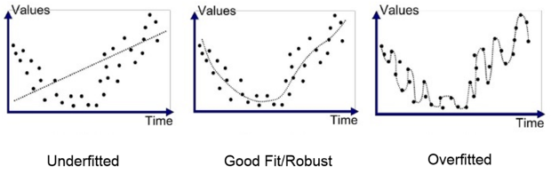

30.  Диагностика модели машинного обучения. Методы, цели.
    ====================================================
    

Диагностика моделей машинного обучения - это неточная наука, здесь нужно принимать в расчет и задачу, и выбор признаков и многие другие факторы.

Обычно определить адекватность какой-либо модели возможно с помощью ряда метрик, которые зависят от характера решаемой задачи.

При классификации на два класса (по сути да/нет) у нас есть 4 различных исхода:

●        True Positive (TP) — истинное значение было "да" и мы предсказали "да"

●        True Negatives (TN) — истинное значение было "нет" и мы предсказали "нет"

●        False Positive (FP) — истинное значение было "нет", а мы предсказали "да". Ложное срабатывание, ошибка I рода.

●        False Negatives (FN) — истинное значение было "да", а мы предсказали "нет". Пропуск цели, ошибка II рода. (ред.) ща

Также для классификации сущенствуют следующие метрики:

●        Accuracy (аккуратность) - процент верных предсказаний

●        Precision (точность) - сколько верных среди предсказанных как "Класс 1/да"

●        Recall (полнота) - сколько из настоящих "Класс 1/да" мы определили верно (то же самое, что True Positive Rate, Sensitivity)

●        F-мера (гармоническое среднее P и R)

●        Log-loss (учитывает значение вероятности) (ред.)

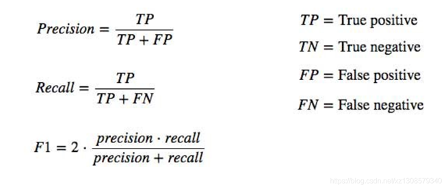

При регрессии у нас работают другие метрики:

Общая идея: насколько хорошо вписывается в данные линия регрессии. Например, как далеко вокруг неё разбросаны все наблюдения:

●      MAE/MAD (Mean Absolute Error, Mean Absolute Deviation) - средний модуль ошибки

●      MSE/MSD (Mean Squared Error/Deviation) - среднеквадратическая ошибка

●      RMSE/RMSD (Root Mean Squared Error) - лучше, чем MSE, потому что выражается в тех же единицах, что и измеряемая величина

●      MAPE/MAPD (Mean Absolute Percentage Error) - ошибка в процентах от самой величины

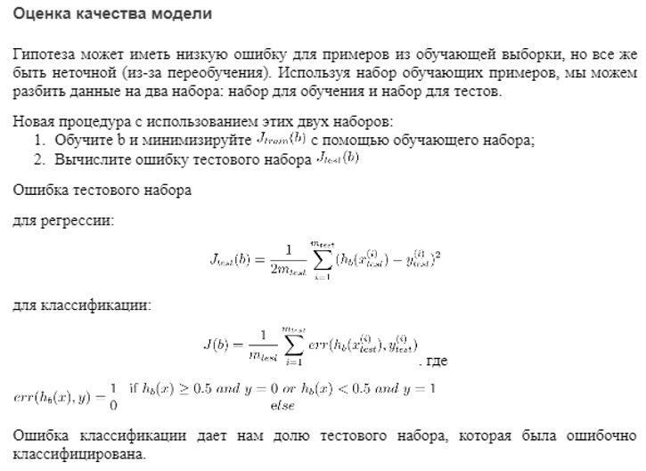

31.  Проблема выбора модели машинного обучения. Сравнение моделей.
    =============================================================
    

Вариант 1

Проверить каждую степень полинома и посмотреть на результат ошибки.

Этот метод без использования третьего, валидационного набора выглядел бы следующим образом:

1.  Оптимизировать параметры b, используя обучающий набор для каждой степени полинома.
2.  Найти степень полинома d с наименьшей ошибкой, используя тестовый набор.
3.  Оценить ошибку обобщения, также используя тестовый набор с,  (d = theta от полинома с более низкой ошибкой).

В этом случае мы обучили одну переменную d или степень полинома, используя тестовый набор. Это приведет к тому, что наше значение ошибки будет больше для любого другого набора данных.

Подобные переменные, не являющиеся параметрами гипотезы, но так или иначе влияющие на точность нашей модели называются гиперпараметрами модели. Обучение гиперпараметров - более сложный и долгий путь и он требует проведения специальной процедуры.

Вариант 2

Для решения проблемы, описанной выше, мы можем ввести третий набор, валидационный набор, чтобы использовать его как промежуточный набор для обучения гиперпараметров. Тогда наш тестовый набор даст нам точную, не оптимистичную ошибку.

Один из возможных примеров разбивки нашего набора данных на три набора:

Обучающий набор (train set): первые 60%; Валидационный набор (validation set): следующие 20%; Тестовый набор (test set): последние 20%.

Теперь мы можем вычислить три отдельных значения ошибки для трех разных наборов.

Метод выбора гипотезы с помощью валидационного набора (этот метод предполагает, что мы не используем регуляризацию и на валидационном наборе)

1.  Оптимизировать параметры b, используя набор тренировок для каждой степени полинома.
2.  Найти степень полинома d с наименьшей ошибкой, используя валидационный набор.
3.  Оценить ошибку обобщения, используя тестовый набор с  (где  b - параметры от полинома с более низкой ошибкой);

Таким образом, степень полинома d не была обучена с использованием тестового набора.

Использование валидационного набора для выбора d означает, что мы также не можем использовать его для процесса проверки правильности установки значения лямбда.

32.  Измерение эффективности работы моделей машинного обучения. Метрики эффективности.
    =================================================================================
    

Что такое метрики эффективности?

Метрики эффективности - это способ показать, насколько точно модель отражает реальный мир.

Метрики эффективность должны выбираться исходя из задачи, которую решает модель.

Функция ошибки и метрика эффективности - это разные вещи, к ним предъявляются разные требования.

В задаче можно (и, зачастую, нужно) применять несколько метрик эффективности.

Наряду с метриками эффективности есть и другие характеристики моделей - скорость обучения, скорость работы, надежность, робастность, интерпретируемость.

Метрики эффективности вычисляются как правило из двух векторов - предсказанных (теоретических) значений целевой переменной и эмпирических (реальных) значений.

Обычно метрики устроены таким образом, что чем выше значение, тем модель лучше

Бывают метрики эффективности моделей классификации и моделей регрессии  

Метрики эффективности моделей классификации:

*   Precision
*   Recall (true positive rate)
*   F1-Score
*   Матрица классификации

Метрики множественной классификации:

*   PR-AUC
*   ROC\_AUC
*   Топ k классов

Метрики регрессии:

*   Средняя квадратичная ошибка (англ. Mean Squared Error, MSE)
*   Cредняя абсолютная ошибка (англ. Mean Absolute Error, MAE)
*   Корень из средней квадратичной ошибки (англ. Root Mean Squared Error, RMSE)
*   Среднеквадратичная логарифмическая ошибка (MSLE)
*   Среднее процентное отклонение (MAPE)
*   Абсолютная медианная ошибка
*   Максимальная ошибка
*   Коэффициент детерминации (r-квадрат)

33.  Метрики эффективности моделей классификации. Виды, характеристика, выбор.
    =========================================================================
    

Метрики эффективности для классификации

Метрики эффективности классификации подсчитывают количество правильно распознанных объектов.

В задачах классификации почти всегда надо применять несколько метрик одновременно.

Тривиальной моделью в задачах классификации считается та, которая предсказывает случайный класс, либо самый популярный класс.

Качество бинарной классификации при прочих равных почти всегда будет сильно выше, чем для множественной.

Вообще, чем больше в задаче классов, тем ниже ожидаемые значения эффективности.

Некоторые метрики работают с метрическими методами, другие - со всеми.

Рассмотрим возможные варианты классификации обучающих примеров в задаче бинарной классификации:

*   Прогнозируемый: 1, Фактический: 1 - Истинный положительный (true positive, TP);
*   Прогнозируемый: 0, Фактический: 0 - Истинный отрицательный (true negative);
*   Прогнозируемый: 0, Фактический, 1 - Ложноотрицательный (false negative);
*   Прогнозируемый: 1, Фактический: 0 - Ложноположительный (false positive).

Возьмём к примеру задачу выявления подозрения на определенное заболевание. Если у пациента оно есть, то это будет положительным классом. Если нет – отрицательным. Результатом работы модели может быть определение – следует ли «заподозрить» у пациента какой-то определенный диагноз (тогда результат = true) или нет (тогда результат = false).

Одной из наиболее простых, а поэтому и распространенной метрикой является точность. Она показывает количество правильно проставленных меток класса (истинно положительных и истинно отрицательных) от общего количества данных и считается следующим образом

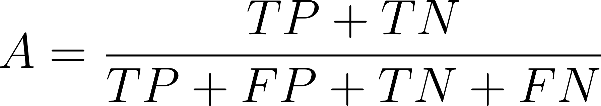

Может быть выражена в процентах и в долях единицы.

Идеальная модель дает точность 1.0, тривиальная - 0.5, самая худшая - 0.0.

Тривиальная модель в множественной сбалансированной задаче классификации дает точность 1/m.

Метрика точности очень чувствительная к несбалансированности классов.

Метрики классификации для неравных классов (precision, recall, F1)

Если классы в задаче не сбалансированы, то метрика точности не дает полного представления о качестве работы моделей.

Для бинарной классификации подсчитывается количество истинно положительных, истинно отрицательных, ложно положительных и ложно отрицательных объектов.

Precision - доля истинно положительных объектов во всех, распознанных как положительные.

Precision характеризует способность модели не помечать положительные объекты как отрицательные (не делать ложно положительных прогнозов).

Recall - для истинно положительных объектов во всех положительных.

Recall характеризует способность модели выявлять все положительные объекты (не делать ложно отрицательных прогнозов).

F1 - среднее гармоническое между этими двумя метриками. F1 - это частный случай. Вообще, семейство F-метрик - это взвешенное среднее гармоническое.

Часто используют все вместе для более полной характеристики модели.

Precision

Эта точность показывает количество истинно положительных исходов из всего набора положительных меток и считается по следующей формуле

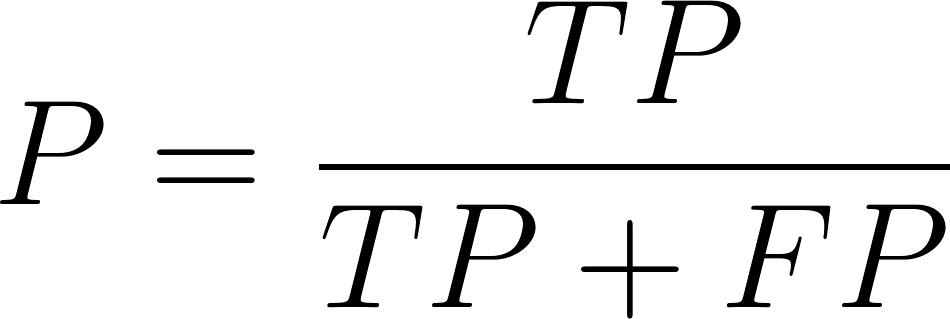

Важность этой метрики определяется тем, насколько высока для рассматриваемой задачи «цена» ложно положительного результата. Если, например, стоимость дальнейшей проверки наличия заболевания у пациента высока и мы просто не можем проверить все ложно положительные результаты, то стоит максимизировать данную метрику, ведь при Precision = 50% из 100 положительно определенных больных  диагноз будут иметь лишь 50 из них.

Recall (true positive rate)

В русском языке для этого термина используется слово «полнота» или «чувствительность». Эта метрика определяет количество истинно положительных среди всех меток класса, которые были определены как «положительный» и вычисляется по следующей формуле

F1-Score

В том случае, если Precision и Recall являются одинаково значимыми, можно использовать их среднее гармоническое для получения оценки результатов

Помимо точечных оценок, существует целый ряд графических методов, способных оценить качество классификации.

metrics.precision\_score(y\_true, y\_pred)  
metrics.recall\_score(y\_true, y\_pred)  
metrics.f1\_score(y\_true, y\_pred)

Матрица классификации

Матрица классификации, или матрица ошибок представляет собой количество объектов по двум осям - истинный класс и предсказанный класс.  
Обычно, истинный класс располагается по строкам, а предсказанный - по столбцам.  
Для идеальной модели матрица должна содержать ненулевые элементы только на главной диагонали.  
Матрица позволяет наглядно представить результаты классификации и увидеть, в каких случаях модель делает ошибки.  
Матрица незаменима при анализе ошибок, когда исследуется, какие объекты были неправильно классифицированы.

confusion\_matrix(y\_true, y\_pred)

Метрики множественной классификации

Метрики для каждого класса рассчитываются, полагая данный класс положительным, а все остальные - отрицательными.  
Каждую метрику можно усреднить арифметически или взвешенно по классам. Весами выступают объемы классов.  
В модуле sklearn реализовано несколько алгоритмов усреднения они выбираются исходя их задачи.  
В случае средневзвешенного, F1-метрика может получиться не между P и R.  
Отчет о классификации содержит всю необходимую информацию в стандартной форме.  
Отчет показывает метрики для каждого класса, а так же объем каждого класса.  
Также отчет показывает средние и средневзвешенные метрики для всей модели.  
Отчет о классификации - обязательный элемент представления результатов моделирования.  
По отчету можно понять сбалансированность задачи, какие классы определяются лучше, какие - хуже.

PR-AUC

Кривая precision-recall используется для методов метрической классификации, которые выдают вероятность принадлежности объекта данному классу.  
Дискретная классификации производится при помощи порогового значения.  
Чем больше порог, тем больше объектов модель будет относить к отрицательному классу.  
Повышение порога в среднем увеличивает precision модели, но понижает recall.  
PR-кривая используется чтобы выбрать оптимальное значение порога.  
PR-кривая нужна для того, чтобы сравнивать и оценивать модели вне зависимости от выбранного уровня порога.  
PR-AUC - площадь под PR-кривой, у лучшей модели - 1.0, у тривиальной - 0.5, у худшей - 0.0.

ROC\_AUC

ROC-кривая показывает качество бинарной классификации при разных значениях порога.  
В отличие от PR-кривой, ROC-кривая монотонна.  
Площадь под графиком ROC-кривой, ROC\_AUC - одна из основных метрик качества классификационных моделей.  
ROC\_AUC можно использовать для сравнения качества разных моделей, обученных на разных данных.  
ROC чаще используют для сбалансированных и множественных задач, PR - для несбалансированных.  
Кривые для множественной классификации строятся отдельно для каждого класса.  
Метрика AUC считается по кривой средних значений.

Топ k классов

Эта метрика - обобщение точности для случая, когда модель выдает вероятности отнесения к каждому классу.  
Вычисляется как доля объектов, для которых правильный класс попадает в список k лучших предсказанных классов.  
Чем больше k, тем выше метрика, но бесполезнее результат.  
Эта метрика часто применяется в задачах с большим количеством классов.  
Применимость этой метрики сильно зависит от характера задачи.

top\_k\_accuracy\_score(y\_true, y\_score, k=2)

34.  Метрики эффективности моделей регрессии. Виды, характеристика, выбор.
    =====================================================================
    

Метрики эффективности для регрессии

Метрики эффективности для регрессий обычно анализируют отклонения предсказанных значений от реальных.

Большинство метрик пришло в машинное обучение из математической статистики.

Результаты работы модели можно исследовать более продвинутыми статистическими методами.

Обычно метрики сравнивают данную модель с тривиальной - моделью, которая всегда предсказывает среднее реальное значение целевой переменной.

Модель могут быть точны на 100%, но плохи они могут быть без ограничений.

Средняя квадратичная ошибка (англ. Mean Squared Error, MSE)

MSE применяется в ситуациях, когда нам надо подчеркнуть большие ошибки и выбрать модель, которая дает меньше больших ошибок прогноза. Грубые ошибки становятся заметнее за счет того, что ошибку прогноза мы возводим в квадрат. И модель, которая дает нам меньшее значение среднеквадратической ошибки, можно сказать, что что у этой модели меньше грубых ошибок.

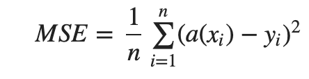

MSE показывает средний квадрат отклонений предсказанных значений от реальных.

Чем выше значение MSE, тем модель хуже. У идеальной модели MSE=0

MSE больше учитывает сильные отклонения, но хуже интерпретируется, чем MAE.

Cредняя абсолютная ошибка (англ. Mean Absolute Error, MAE)

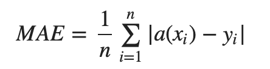

MAE показывает среднее абсолютное отклонение предсказанных значений от реальных.

Чем выше значение MAE, тем модель хуже. У идеальной модели MAE=0

MAE очень легко интерпретировать - на сколько в среднем ошибается модель.

Среднеквадратичная ошибка подходит для сравнения двух моделей или для контроля качества во время обучения, но не позволяет сделать выводов о том, на сколько хорошо данная модель решает задачу.

Корень из средней квадратичной ошибки (англ. Root Mean Squared Error, RMSE)

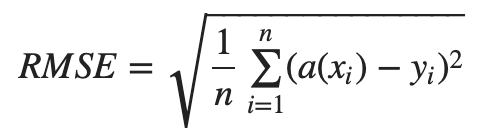

RMSE - это по сути корень из MSE. Выражается в тех же единицах, что и целевая переменная.

Чаще применяется при статистическом анализа данных.

Данная метрика очень чувствительна к аномалиям и выбросам.

Среднеквадратичная логарифмическая ошибка (MSLE)

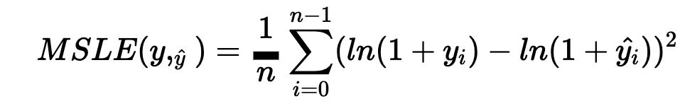

MSLE это среднее отклонение логарифмов реальных и предсказанных данных.

Так же, идеальная модель имеет MSLE=0

Данная метрика используется, когда целевая переменная простирается на несколько порядков величины.

Еще эта метрика может быть полезна, если моделируется процесс в экспоненциальным ростом.

Среднее процентное отклонение (MAPE)

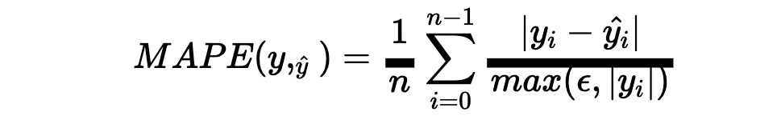

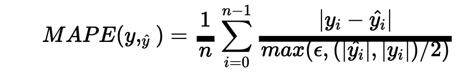

Идея этой метрики - это чувствительность к относительным отклонениям.

Данная модель выражается в процентах и имеет хорошую интерпретируемость.

Идеальная модель имеет MAPE=0. Верхний предел - не ограничен.

Данная метрика отдает предпочтение предсказанию меньших значений.

Абсолютная медианная ошибка

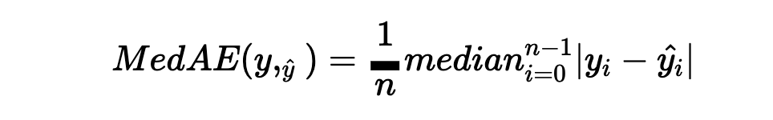

Медианная абсолютная ошибка похожа на среднюю абсолютную, но более устойчива к аномалиям.

Применяется в задачах, когда известно, что в данных присутствуют выбросы, аномальные , непоказательные значения.

Эта метрика более робастная, нежели MAE.

Максимальная ошибка

Максимальная ошибка показывает наихудший случай предсказания модели.

В некоторых задачах важно, чтобы модель не ошибалась сильно, а небольшие отклонения не критичны.

Зачастую эта метрика используется как вспомогательная совместно с другими.

Коэффициент детерминации (r-квадрат)

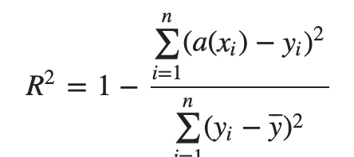

Коэффициент детерминации показывает силу связи между двумя случайными величинами.

Если модель всегда предсказывает точно, метрика равна 1. Для тривиальной модели - 0.

Значение метрики может быть отрицательно, если модель предсказывает хуже, чем тривиальная.

Это одна из немногих несимметричных метрик эффективности.

Эта метрика не определена, если .Надо следить, чтобы в выборке присутствовали разные значения целевой переменной.

Коэффициент детерминации измеряет долю дисперсии, объясненную моделью, в общей дисперсии целевой переменной. Фактически, данная мера качества — это нормированная среднеквадратичная ошибка. Если она близка к единице, то модель хорошо объясняет данные, если же она близка к нулю, то прогнозы сопоставимы по качеству с константным предсказанием

35.  Перекрестная проверка (кросс-валидация). Назначение, схема работы.
    ==================================================================
    

Кросс-валидация

С помощью кросс-валидации эмулируется наличие тестовой выборки, которая не участвует в обучении, но для которой известны правильные ответы.

Разбиение выборки на обучающую и тестовую может внести случайные ошибки.

Нужно повторить разбиение несколько раз, посчитать метрики и усреднить.

Кросс-валидация разбивает выборку на k блоков, каждый из которых используется по очереди как тестовый. Сколько задать k, столько и будет проходов. Обычно берут 3 или 5.

Чем больше k тем надежнее оценка, но дольше ее получение, так как модель каждый раз заново обучается.

Использование кросс-валидации обязательно для получения робастных оценок.

В библиотеке sklearn кросс-валидация (CV) встроена во многие функции.

from sklearn.model\_selection import cross\_validate

scoring = \['precision\_macro','recall\_macro'\]

model = svm.SVC(kernel='linear', C=1, random\_state=0)

scores = cross\_validate(model, X, y, scoring=scoring)

sorted(scores.keys())

scores\['test\_recall\_macro'\]

k-fold кросс-валидация

Обучающая выборка разбивается на k непересекающихся одинаковых по объему частей;

1.  Производится k итераций. На каждой итерации происходит следующее:
2.  Модель обучается на k−1 части обучающей выборки;
3.  Модель тестируется на части обучающей выборки, которая не участвовала в обучении.

Каждая из k частей единожды используется для тестирования. Как правило, k=10 (5 в случае малого размера выборки).

36.  Конвейеры в библиотеке sklearn. Назначение, использование.
    ==========================================================
    

Конвейер – это последовательность шагов при преобразовании данных. Он создается в соответствии со старинным паттерном проектирования «канал и фильтр» Однако конвейеры – это объекты в коде. Следовательно, у вас может быть класс для каждого фильтра (то есть, для каждого этапа конвейера), а также еще один класс для комбинации всех этих этапов в готовый конвейер. Некоторые конвейеры могут объединять другие конвейеры последовательно или параллельно, иметь много входов или выходов и т.д. Конвейеры машинного обучения удобно рассматривать как:

Канал и фильтры. На этапах конвейера обрабатываются данные, причем, этапы управляют своим внутренним состоянием, которое можно узнать из данных.

Компоновка. Конвейеры можно вкладывать друг в друга; например, целый конвейер можно трактовать как один этап в рамках другого конвейера. Эта конвейера не обязательно является конвейером, но конвейер как таковой по определению – не менее чем этап конвейера.

Ориентированные ациклические графы (DAG). Вывод этапа конвейера может направляться множеству других этапов, после чего результирующие выводы могут рекомбинироваться и так далее. Отметим: несмотря на то, что конвейеры ацикличны, они могут обрабатывать множество элементов один за другим, и, если их состояние меняется (например, при использовании метода fit\_transform на каждом этапе), то их можно считать рекуррентно разворачивающимися во времени, сохраняющими при этом свои состояния (по образцу RNN).

Методы конвейера

Конвейеры (или этапы конвейера) обязательно должны обладать следующими двумя методами:

*   “fit” для обучения на данных и приобретения состояния (напр., таким состоянием являются веса нейронной сети)
*   “transform” (или “predict”) для фактической обработки данных и генерации прогноза.

На этапах конвейера также могут опционально определяться следующие методы:

*   “fit\_transform” для подгонки и последующего преобразования данных, но в один проход, что допускает потенциальную оптимизацию кода в случаях, когда два метода должны выполняться непосредственно один после другого.
*   “setup” который будет вызывать метод “setup” на каждом из таких этапов конвейера.
*   “teardown”, этот метод функционально противоположен “setup”: он сносит ресурсы.

Следующие методы предоставляются по умолчанию, обеспечивая управление гиперпараметрами:

*   “get\_hyperparams” возвращает словарь гиперпараметров. Если конвейер содержит другие (вложенные) конвейеры, то ключи гиперпараметров сцепляются при помощи двойных нижних подчеркиваний “\_\_”.
*   “set\_hyperparams” позволяет задавать новые гиперпараметры в том же формате, в каком вы их получаете.
*   “get\_hyperparams\_space” позволяет вам получить пространство гиперпараметра, которое будет непустым, если вы определили гиперпараметр. Поэтому, все отличие от “get\_hyperparams” в данном случае таково, что вы получаете в качестве значений статистические распределения, а не точное значение.
*   “set\_hyperparams\_space” может использоваться для задания нового пространства при помощи тех же классов для распределения гиперпараметров, что и в случае с “get\_hyperparams\_space”.

Самое заметное преимущество конвейеров — способность объединять все этапы предварительной обработки и моделирования в единственный оценщик, предотвращать утечку данных и не вызывать fit на наборах данных для валидации. А ещё конвейер — это бонус в виде краткого, воспроизводимого, модульного кода.

Инструмент Pipeline позволяет объединить несколько операций обработки данных в единую модель библиотеки Python «Scikit-learn». Класс Pipeline предусматривает методы fit, predict и score, имеющие свойства, аналогичные свойствам модели в библиотеке «Sckit-learn». В Машинном обучении чаще всего класс Pipeline используется для объединения операций предварительной обработки (например, масштабирования данных или one-hot-encoding) с моделью машинного обучения типа классификаторов. Его использование позволяет избежать ошибок и сокращает временные издержки.

Основное преимущество Pipeline:

*   на входе можем подать абсолютно «сырые» данные, которые будут обработаны внутри pipeline, в результате чего на выходе будет получен необходимый нам результат (predict);
*   обработка данных происходит сразу как для обучающей выборки, так и для тестовой, что избавляет нас от дублирования кода и, соответственно, уменьшает вероятность совершения ошибок в коде.

37.  Использование методов визуализации данных для предварительного анализа.
    =======================================================================
    

Диаграмма рассеяния (Scatter plot) в matplotlib

Диаграмма рассеяния отображает пространство одних вещественных чисел в пространстве других вещественных чисел. Иными словами, каждая точка одного атрибута соответствует каждой точке другого. В matplotlib он имеет название scatter:

plt.xlabel('points')

plt.ylabel('price')

plt.scatter(x=data\['points'\], y=data\['price'\])

xlabel и ylabel служат для обозначения осей x и y, соответственно. В качестве аргументов принимает одномерные массивы x и y

Диаграмма рассеяния может служить для визуализации линейных моделей машинного обучения, такие как линейная регрессия и метод опорных векторов.

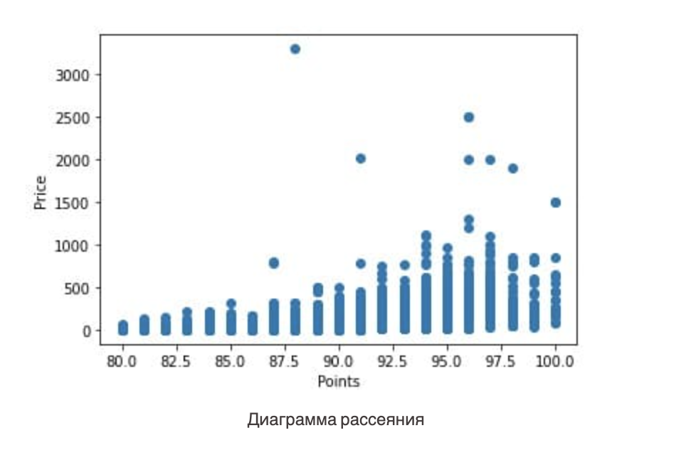

Линейный график (plot) в matplotlib

Линейный график необходим для построения линии от точки к точке. В matplotlib.pyplot он называется plot:

d = data.groupby('points').mean()

plt.xlabel('points')

plt.ylabel('Средняя цена')

plt.plot(d.index, d.values)

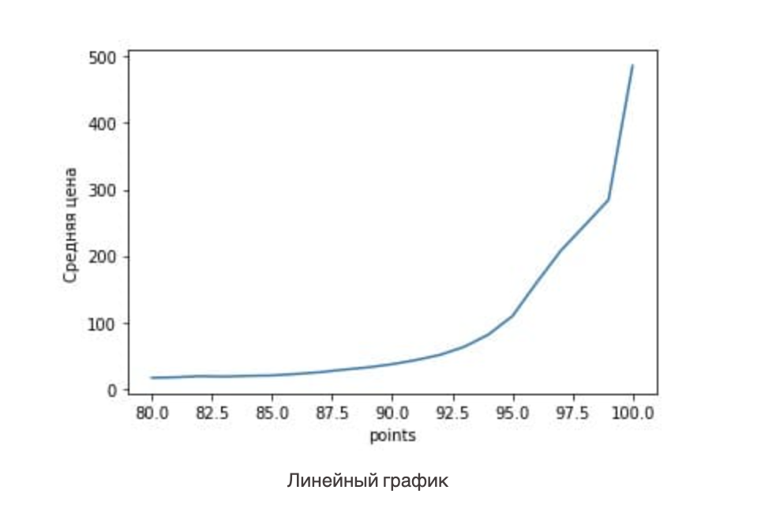

Барный график (bar plot)

Барный график представляет собой столбчатую диаграмму, которая показывает количественное отношение категориального признака.

countries = data\['country'\].value\_counts().head(7)

plt.xlabel('Cтрана')

plt.ylabel('Количество вин')

plt.bar(x=countries.index, height=countries.values)

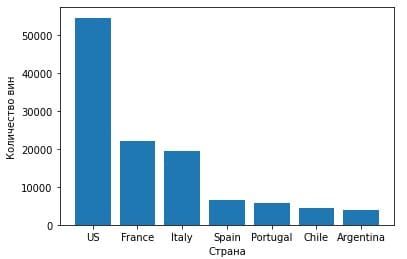

Гистограмма (hist plot)

Для отображения частотного показателя анализируемого атрибута используется гистограмма. Гистограммы похожи на барный график за исключением того, что вместо категориальных признаков берутся числовые, поэтому используются диапазоны значений. Кроме того, с помощью гистограмм можно построить плотность распределения. Так и сделаем. В matplolib гистограмма имеет название hist:

plt.xlabel('points')

plt.ylabel('Вероятность')

plt.hist(x=data\['points'\], bins=40, density=True)

В качестве аргумента он принимает x, как массив значений, bins — количество значений, разбиваемых на диапазоны, denisty, равное True, представляет данные в виде плотности распределения.

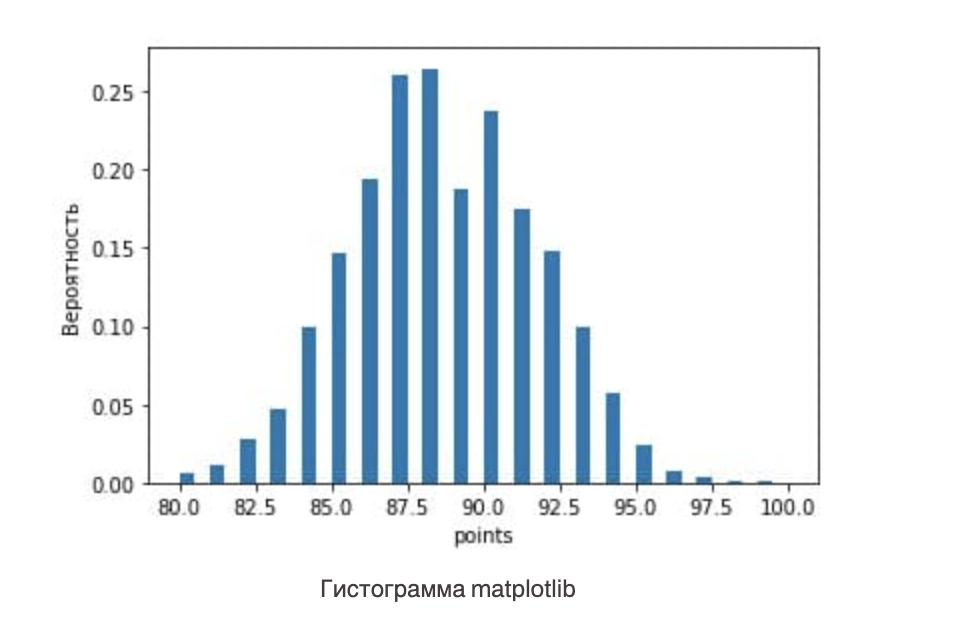

Ящик с усами (box plot)

Ящик с усами, он же диаграмма размаха, можно сравнить с плотностью распределения. Он тоже показывает диапазон значений, лежащих около среднего. Помимо прочего, с его помощью можно определить выбросы — те данные, которые находятся далеко от среднего. Удаление выбросов является важным шагом подготовки модели машинного обучения. В matplotlib ящик с усами называется boxplot:

plt.boxplot(x=data\['points'\])

Основным аргументом является x, принимающий массив анализируемых числовых значений.

Нижняя и верхняя границы соответствуют 25% и 75% квартилям, соответственно; горизонтальная черта внутри ящика показывает среднее значение; а концы “усов” определяются, как края статистически значимой выборки

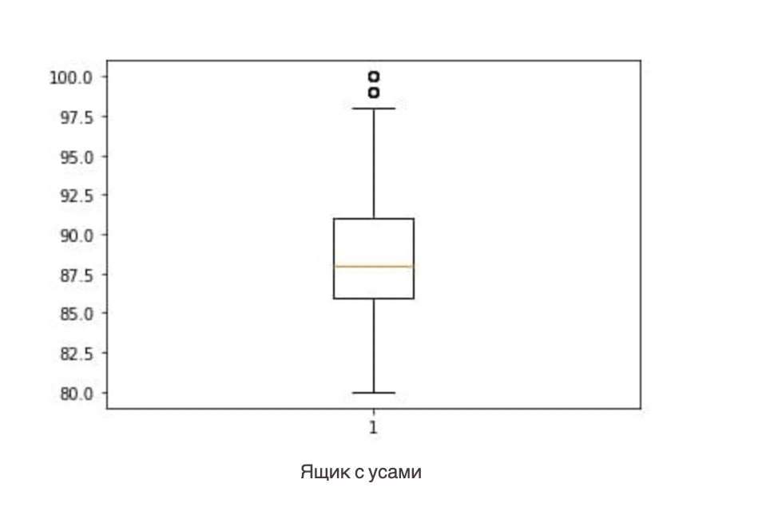

38.  Исследование коррелированности признаков: методы, цели, выводы.
    ===============================================================
    

Корреляция – это мера линейной связи двух или более переменных. При её помощи мы можем предсказать одну переменную через другую. Логика использования этого метода для выбора характеристик заключается в том, что “хорошие” переменные сильно коррелируют с нашей целью.

Стоит отметить, что переменные должны коррелировать с целевым показателем, но не должны между собой

Одним из способов количественной оценки этой взаимосвязи является использование коэффициента корреляции Пирсона , который является мерой линейной связи между двумя переменными . Он имеет значение от -1 до 1, где:

*   \-1 указывает на совершенно отрицательную линейную корреляцию между двумя переменными
*   0 указывает на отсутствие линейной корреляции между двумя переменными
*   1 указывает на совершенно положительную линейную корреляцию между двумя переменными.

Чем дальше коэффициент корреляции от нуля, тем сильнее связь между двумя переменными.

Но в некоторых случаях мы хотим понять корреляцию между более чем одной парой переменных. В этих случаях мы можем создать матрицу корреляции , представляющую собой квадратную таблицу, которая показывает коэффициенты корреляции между несколькими переменными.

Каждая ячейка в таблице показывает корреляцию между двумя конкретными переменными.

Поскольку матрица корреляции симметрична, половина коэффициентов корреляции, показанных в матрице, являются избыточными и ненужными. Таким образом, иногда будет отображаться только половина корреляционной матрицы

На практике корреляционная матрица обычно используется по трем причинам:

1\. Корреляционная матрица удобно обобщает набор данных.

Матрица корреляции — это простой способ суммировать корреляции между всеми переменными в наборе данных.

2\. Корреляционная матрица служит диагностикой регрессии.

Одним из ключевых допущений множественной линейной регрессии является то, что ни одна независимая переменная в модели не имеет сильной корреляции с другой переменной в модели.

Когда две независимые переменные сильно коррелированы, это приводит к проблеме, известной как мультиколлинеарность , и может затруднить интерпретацию результатов регрессии.

Один из самых простых способов обнаружить потенциальную проблему мультиколлинеарности — посмотреть на матрицу корреляции и визуально проверить, сильно ли коррелируют какие-либо переменные друг с другом.

3\. Корреляционная матрица может использоваться в качестве исходных данных для других анализов.

Корреляционная матрица используется в качестве исходных данных для других сложных анализов, таких как исследовательский факторный анализ и модели структурных уравнений.

39.  Решкалирование данных. Виды, назначение, применение. Нормализация и стандартизация данных.
    ==========================================================================================
    

Нормализация (normalization) и стандартизация (standardization) являются методами изменения диапазонов значений – решкалирования.

Нормализация — это преобразование данных к неким безразмерным единицам. Иногда — в рамках заданного диапазона, например, \[0..1\] (каждое значение нужно разделить на максимальное)

или \[-1..1\]. Иногда — с какими-то заданным свойством, как, например, стандартным отклонением равным 1.

Ключевая цель нормализации — приведение различных данных в самых разных единицах измерения и диапазонах значений к единому виду, который позволит сравнивать их между собой или использовать для расчёта схожести объектов. Нормализация признаков нужна для ускорения обучения и сходимости градиентного спуска. Основная идея нормализации - это сделать так, чтобы все признаки измерялись по одной шкале, то есть лежали в одних пределах.

Во многих реализациях моделей нормализация уже встроена и применяется по умолчанию.

Методы нормализации:

●      Минимакс – линейное преобразование данных в диапазоне \[0..1\], где минимальное и максимальное масштабируемые значения соответствуют 0 и 1 соответственно (реализовано в sklearn.preprocessing.MinMaxScaler)

●      Десятичное масштабирование путем удаления десятичного разделителя значения переменной.

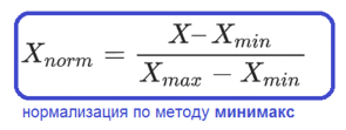

Стандартизация – техника преобразования значений признака, адаптирующая признаки с разными диапазонами значений к моделям, использующих дистанцию для прогнозирования. Стандартизация - приведение к стандартному распределению. Нормализация - это параметрическое преобразование, нужно запоминать, на что делили или что отнимали. К отдельным случаям применяются более крутые алгоритмы решкалирования с автоматическим устранением выбросов.

Z-масштабирование -  стандартизация данных на основе среднего значения и стандартного отклонения: деление разницы между переменной и средним значением на стандартное отклонение

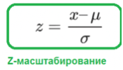

Такое преобразование необходимо, поскольку признаки датасета могут иметь большие различия между своими диапазонами, и для моделей, основанных на вычислении дистанции между точками на графике как основу прогнозирования (Метод k-ближайших соседей (kNN), Метод опорных векторов (SVM), Дерево решений (Decision Tree)) это спровоцирует искаженное восприятие данных.

40.  Преобразование категориальных признаков в числовые.
    ===================================================
    

Иногда бывает целесообразно сгруппировать объекты датасета по значению какого-то признака и заменить его названием группы. В таком случае, мы удаляет часть информации из модели, но это может быть лишняя вариативность. Такое нужно делать, только если есть уверенность, что объекты внутри группы одинаково относятся к целевой переменной.

Границы групп выбирают вручную, от этого многое зависит.

Категориальные признаки часто выражаются строковыми данными и не подходят для использования в машинном обучении, их преобразуют в численные.

Существует несколько способов преобразовать категории в числа, каждый из них имеет свои плюсы и минусы. Выбор метода зависит от типа и смысла ваших данных, мощности множества категорий, алгоритма машинного обучения.

Самый простой кодировщик - LabelEncoder - просто нумерует все значения категориального признака (нумерация категориальных значений).

У данного подхода есть существенный недостаток. Обычно он ведет к плохому результату так как, алгоритмы начинают учитывать бессмысленную упорядоченность значений признаков. Однако данный метод имеет преимущество с точки зрения памяти. Метод реализован в классе sklearn.preprocessing.LabelEncoder.  Из одного признака может получиться тысяча.

dummy-кодирование или фиктивные переменные. При подборе алгоритмов машинного обучения (таких как линейная регрессия , логистическая регрессия, случайные леса и т. д.) мы часто преобразовываем категориальные переменные в фиктивные переменные , которые представляют собой числовые переменные, используемые для представления категориальных данных. Фиктивная переменная – это числовая переменная, представляющая собой подкатегории или подгруппы категорических переменных набора данных.

В двух словах, фиктивная переменная позволяет нам различать различные подгруппы данных, и в зависимости от того, что также позволяет использовать данные для регрессионного анализа.

Чтобы создать фиктивные переменные для переменной в кадре данных pandas, мы можем использовать функцию pandas.get\_dummies() , которая использует следующий базовый синтаксис:

pandas.get\_dummies (данные, префикс = нет, столбцы = нет, drop\_first = ложь)

Более продвинутый кодировщик - OneHotEncoder - преобразует один признак во множество. Суть заключается в создании дополнительных N признаков (столбцов), где N – количество уникальных категорий. Новые признаки принимают значения 0 или 1 в зависимости от принадлежности к категории.

One-hot encoder значительно увеличивает объем данных, что делает его неэффективным с точки зрения памяти, частично эту проблему решает применение разреженных матриц. Метод реализован в классе sklearn.preprocessing.OneHotEncoder.

Преобразовать категориальные признаки в числовые можно также с помощью replace и map.

41.  Методы визуализации данных для машинного обучения.
    ==================================================
    

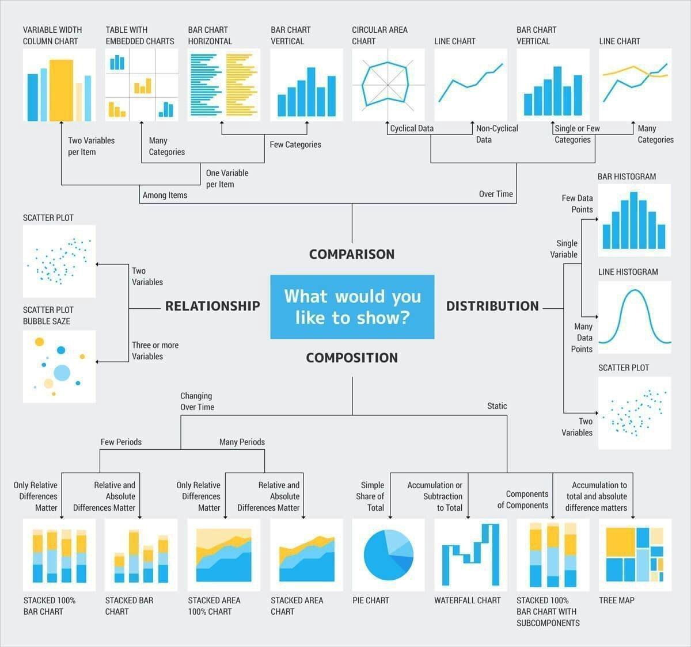

Визуализация данных — это большая часть работы специалистов в области data science. На ранних стадиях развития проекта часто необходимо выполнять разведочный анализ данных, чтобы выявить закономерности, которые обнаруживают данные. Визуализация данных помогает представить большие и сложные наборы данных в простом и наглядном виде. На этапе окончания проекта важно суметь отчитаться о его результатах так, чтобы даже непрофессионалам, не обладающим техническими знаниями, всё стало ясно и понятно.

Matplotlib — это популярная библиотека для визуализации данных, написанная на языке Python.

Основные графики из matplotlib:

Диаграммы рассеяния (Scatter Plots)
-----------------------------------

        ax.scatter(x\_data, y\_data, s \= 10, color \= color, alpha \= 0.75)

Используйте их, если хотите показать связь между двумя переменными, так как они позволяют отображать грубое распределение данных. На нем также можно показать соотношение между различными группами данных за счет окрашивания их разными цветами.

Графики (Plots)

ax.plot(x\_data, y\_data, lw \= 2, color \= '#539caf', alpha \= 1)

Графики лучше всего использовать тогда, когда одна переменная сильно варьируется в зависимости от другой, другими словами, когда у них высокая ковариация. Графики, выполненные в виде линий, показывают ковариации двух переменных (в данном случае процент и временной промежуток). Мы можем использовать группировку с помощью цвета.

Гистограммы (Histograms)
------------------------

ax.hist(data, n\_bins \= n\_bins, cumulative \= cumulative, color \= 'red')        

Гистограммы полезны для представления (или даже выявления) распределения данных. Использование столбцов (а не точек рассеивания, например) действительно дает нам четкую визуализацию относительной разницы между частотой каждого интервала. Использование полос (интервалов = дискретизация) действительно помогает нам увидеть «целостную картину». Если эти же данные представить в виде отдельных точек, без выделения интервалов, то на диаграмме появится слишком много шума, что затруднит понимание тенденции, которая иллюстрируется с помощью этих данных. Параметры n\_bins определяют, сколько отдельных интервалов нам необходимо поместить на нашей гистограмме. Большее число интервалов даст нам более точную информацию, но может также ввести информационный шум и отвлечь нас от понимания целостной картины; с другой стороны, меньшее число интервалов обеспечивает нам вид с высоты птичьего полёта и целостную картину того, что происходит, при этом не перегружая её мельчайшими деталями. Во-вторых, параметр cumulative является булевым (то есть 1 или 0), что позволяет нам выбрать, является ли наша гистограмма кумулятивной или нет. Другими словами, мы задаем либо плотность вероятности ( Probability Density Function (PDF)) либо функцию интегрального распределения ( Cumulative Density Function (CDF)).

Столбчатые диаграммы (Bar Plots)

Столбчатые диаграммы наиболее эффективны тогда, когда вам необходимо визуализировать данные в виде категорий, если их число не превышает 10. Если у нас слишком много категорий, то столбцы будут сильно загромождать график, и его трудно будет понять. Они хороши для данных, разделенных по категориям, потому что вы можете легко увидеть разницу между категориями в зависимости от размера столбца (например, величины); категории также легко можно сформировать и выделить цветом. Есть три разных типа столбчатых диаграмм, которые мы будем рассматривать далее: обычные, сгруппированные и составные.

ax.bar(x\_data, y\_data, color \= '#539caf', align \= 'center')

В функции barplot() x\_data задает метки на оси x, а y\_data задает высоту столбца по оси y. Строка ошибки представляет собой дополнительную линию, расположенную в центре каждого столбца, которая может быть использована для отображения стандартного отклонения.

Прямоугольные диаграммы (Box Plots)
-----------------------------------

ax.boxplot(y\_data)        

Гистограммы подходят для визуализации распределения переменных. Может быть, нам необходимо более наглядное представление стандартного отклонения? Возможно, медиана сильно отличается от среднего значения, и, следовательно, у нас много отклонений? Что, если имеются скосы, и многие из значений сосредоточены на одной стороне?

Вот здесь и вступают в игру прямоугольные диаграммы. Именно они помогают нам дополнительно разместить выше указанную информацию. Нижняя и верхняя части ящика, составленного сплошной линией, всегда являются первым и третьим квартилями (т.е. 25% и 75% данных), а полоса внутри прямоугольника всегда вторая квартиль (медиана). Усы (то есть пунктирные линии с полосками на конце) начинаются от прямоугольника и показывают диапазон данных.

Поскольку прямоугольные диаграммы строятся для каждой группы / переменной, их достаточно легко настраивать. x\_data — это список групп / переменных. Функция Matplotlib boxplot() создает график для каждого столбца y\_data или каждого вектора в последовательности y\_data; таким образом, каждое значение в x\_data соответствует столбцу / вектору в y\_data. Все, что нам остается добавить, — это внешний вид графика.

Seaborn — это по сути более высокоуровневое API на базе библиотеки matplotlib. Seaborn содержит более адекватные дефолтные настройки оформления графиков. Также в библиотеке есть достаточно сложные типы визуализации, которые в matplotlib потребовали бы большого количество кода. [Seaborn](https://www.google.com/url?q=https://seaborn.pydata.org/&sa=D&source=editors&ust=1674518513376280&usg=AOvVaw2Fcf939lctVq_bt4Lb06P3) — это библиотека для создания статистических графиков на Python. Она основывается на [matplotlib](https://www.google.com/url?q=https://matplotlib.org/&sa=D&source=editors&ust=1674518513376569&usg=AOvVaw1vWkDw3QCVGGZoN066dzGZ) и тесно взаимодействует со [структурами данных pandas](https://www.google.com/url?q=https://livecodestream.dev/post/how-to-work-with-pandas-in-python/&sa=D&source=editors&ust=1674518513376786&usg=AOvVaw3kP669OuFXy72_cx0holsv). Архитектура Seaborn позволяет вам быстро изучить и понять свои данные. Seaborn захватывает целые фреймы данных или массивы, в которых содержатся все ваши данные, и выполняет все внутренние функции, нужные для семантического маппинга и статистической агрегации для преобразования данных в информативные графики.

Основные графики seaborn.

### Линейный график — Line Plot

Этот график рисует линию, которая представляет собой развитие непрерывных или категориальных данных. Этот вид графиков популярен и известен, и его легко создать. Как и раньше, мы воспользуемся функцией lineplot с набором данных и столбцами, представляющими оси x и y. Остальное за нас сделает seaborn. Линейный график состоит из точек, соединённых линией, которая показывает связь между переменными x и y. Ось x обычно содержит временные интервалы, ось y — числовую переменную, изменения которой во времени нужно отследить.

sns.lineplot(data=flights\_data, x="year", y="passengers")

### Столбчатая диаграмма — Bar Plot

Наверное, это самый известный тип диаграммы, и, как вы уже догадались, мы можем построить этот тип диаграмм с помощью seaborn, также, как мы сделали это для линейного графика и диаграммы рассеяния, с помощью функции barplot.

sns.barplot(data=flights\_data, x="year", y="passengers")

Гистограммы отображают числовые величины на одной оси и переменные категории на другой. Они позволяют вам увидеть, значения параметров для каждой категории.

Гистограммы можно использовать для визуализации временных рядов, а также только категориальных данных.

Чтобы нарисовать гистограмму в Seaborn нужно вызвать функцию barplot(), и передать ей категориальные и числовые переменные, которые нужно визуализировать. Зависимость между двумя элементами визуализируется на гистограмме. Чтобы нарисовать горизонтальную, а не вертикальную гистограмму нужно просто поменять местами переменные передаваемые в x и y. В этом случае категориальная переменная будет отображаться по оси Y, что приведет к постройке горизонтального графика. Часто требуется группировать столбцы на графиках по одному признаку. Допустим, вы хотите сравнить некоторые общие данные и сгруппировать их по заданным критериям. Нам может потребоваться визуализировать количество выживших пассажиров, в зависимости от класса (первый, второй и третий), но также учесть, города из которого они прибыли. Всю эту информацию можно легко отобразить на гистограмме. Чтобы сгруппировать столбцы вместе, мы используем аргумент hue. Этот аргумент группирует соответствующие данные и сообщает библиотеке Seaborn, как раскрашивать столбцы. Вы можете изменить порядок следования столбцов по умолчанию. Это делается с помощью аргумента order, который принимает список значений и порядок их размещения.

#### Парные диаграммы

Pairplot для сравнения распределения пар числовых переменных создаёт сетку точечных диаграмм. Он также содержит гистограмму для каждой функции в диагональных прямоугольниках. Эта визуализация поможет нам посмотреть на одной картинке, как связаны между собой различные признаки. Остальные же графики — это обычные scatter plots для соответствующих пар признаков.

sns.pairplot()

Стоит обратить внимание на:

*   Диаграммы рассеяния, показывающие положительные линейные отношения (когда x увеличивается, увеличивается y), либо отрицательные (когда x увеличивается, y уменьшается).
*   Гистограммы в диагональных прямоугольниках, показывающие распределение конкретных признаков.

На парной диаграмме обведённые диаграммы показывают очевидную линейную зависимость. Диагональ указывает на гистограммы каждого признака; левый треугольник парной диаграммы — зеркальное отражение правого треугольника.

#### Тепловая карта

Тепловая карта — графическое представление значений в сетке цветовой кодировкой. Нанесённые значения — это коэффициенты корреляции пар, отражающие меру линейных отношений, поэтому диаграмма идеальна для пары. Тепловая карта отображает значения с помощью цвета, тогда как парная диаграмма показывает интуитивно понятные тенденции данных.

*   vmin, vmax — устанавливают диапазон значений, которые служат основой для цветовой карты (colormap).
*   cmap — определяет конкретную colormap, которую мы хотим использовать.
*   center — принимает вещественное число для центрирования цветовой карты; если cmap не указан, используется colormap по умолчанию; если установлено значение True — все цвета заменяются на синий.
*   annot — при значении True числовые значения корреляции отображаются внутри ячеек.
*   cbar — если установлено значение False, цветовая шкала (служит легендой) исчезает.

Для работы с heatmap лучше всего подходит расходящаяся цветовая палитра.

sns.heatmap()

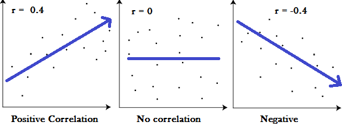

#### Диаграмма рассеяния

Диаграмма рассеяния показывает взаимосвязь между двумя числовыми признаками с помощью точек, показывающих движение этих переменных вместе.

sns.scatterplot()

#### Гистограмма

Гистограмма использует столбцы разной высоты для сравнения распределения числовой переменной между группами категориальной переменной. По умолчанию высота столбца оценивается с помощью «среднего»: параметр estimator изменяет эту функцию агрегирования с помощью встроенных функций Python, таких как estimator=max или len, или функций NumPy наподобие np.max и np.median.

sns.barplot()

#### Ящик с усами

Ящик с усами визуализирует распределение между числовыми и категориальными переменными, отображая информацию о квартилях.

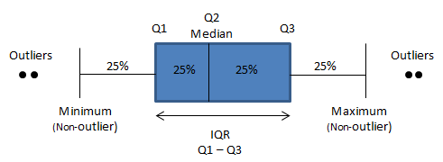

На диаграммах видно наименьшее значение, медиану, наибольшее значение и выбросы для каждого класса категорий.

sns.boxplot()

Главные советы при подобной визуализации:

*   не используйте сложных средств визуализации (Вы должны досконально понимать, как происходит сама визуализация),
*   не используйте параметров по умолчанию при визуализации («посмотреть на данные» — это тоже процедура, которая нуждается в обучении, т.е. настройке параметров),
*   понимайте достоинства и недостатки (что скрывает) конкретного типа визуализации.

Для визуализации одномерных данных лучше использовать обычные гистограммы. Диаграммы рассеивания удобны для анализа пар признаков.

В современных библиотеках много способов визуализации двумерной выборки, но для целей разведывательного анализа и «плохих» данных (с выбросами) лучше подойдут обычные диаграммы рассеивания.

Часто вместо всей выборки имеет смысл визуализировать подвыборку (быстрее строится визуализация, лучше видна плотность скопления точек). Имеет смысл также удалять часть экстремальных значений (чтобы все точки были сконцентрированы в одной области и координаты не растягивались из-за выбросов).

Если один из признаков категориальный, а другой вещественный, то лучше построить распределения по второму для разных значений категорий первого.

Визуализация нужна не только для нахождения особенностей признаков и придумывания новых. Иногда она заставляет задуматься о том, как работает наша модель. Всегда полезно смотреть на диаграммы рассеивания, построенные по ответам двух разных алгоритмов, особенно если один из алгоритмов простой и надёжный бенчмарк, тогда сразу видно, есть ли артефакты в работе сложной модели.

При подготовке данных для визуализации помните, что

*   Возможно, требуется предварительная очистка данных от выбросов
*   Возможно, требуется изменение шкалы (например, логарифмирование)

При создании рисунка помните, что, возможно, его кому-то придётся показывать

*   Подпишите график, оси, сделайте метки данным
*   Для объектов разной природы выберите цвета, которые и в градациях серого (например, при распечатке на чёрно-белом принтере) будут разными
*   Храните данные и код для получения картинки, а не только само изображение (в 99 случаях из 100 его придётся немного переделать)

42.  Задача выбора модели. Оценка эффективности, валидационный набор.
    ================================================================
    

Валидационный набор

     Если алгоритм обучения хорошо подходит для тренировочного набора, это не значит, что это хорошая гипотеза. Ошибка вашей гипотезы, измеренная в наборе данных, с которым вы подготовили параметры, будет ниже, чем на любом другом наборе данных.

Чтобы выбрать модель вашей гипотезы, вы можете проверить каждую степень полинома и посмотреть на результат ошибки. Метод без использования третьего, валидационного набора (обратите внимание: это плохой метод - не используйте его) выглядел бы следующим образом:

1.  Оптимизируйте параметры b, используя обучающий набор для каждой степени полинома.
2.  Найдите степень полинома d с наименьшей ошибкой, используя тестовый набор.
3.  Оцените ошибку обобщения, также используя тестовый набор с  , (d = theta от полинома с более низкой ошибкой);

В этом случае мы обучили одну переменную d или степень полинома, используя тестовый набор. Это приведет к тому, что наше значение ошибки будет больше для любого другого набора данных.

Подобные переменные, не являющиеся параметрами гипотезы, но так или иначе влияющие на точность нашей модели называются гиперпараметрами модели. Обучение гиперпараметров - более сложный и долгий путь и он требует проведения специальной процедуры.

Чтобы решить эту проблему, мы можем ввести третий набор, валидационный набор, чтобы использовать его как промежуточный набор для обучения гиперпараметров. Тогда наш тестовый набор даст нам точную, не оптимистичную ошибку.

Один из возможных примеров разбивки нашего набора данных на три набора:

1.  Обучающий набор (train set): первые 60%;
2.  Валидационный набор (validation set): следующие 20%;
3.  Тестовый набор (test set): последние 20%.

Этот лишь одна из самых простых схем разбиения набора данных. С помощью специальной техники - кросс-валидации или перекрестной проверки - процесс разбиения набора автоматизируется и становится более робастным. Пока не будем рассматривать эту продвинутую технику выбора модели.

Теперь мы можем вычислить три отдельных значения ошибки для трех разных наборов.

Метод выбора гипотезы с помощью валидационного набора (обратите внимание: этот метод предполагает, что мы не используем регуляризацию и на валидационном наборе)

1.  Оптимизируйте параметры b, используя набор тренировок для каждой степени полинома.
2.  Найдите степень полинома d с наименьшей ошибкой, используя валидационный набор.
3.  Оцените ошибку обобщения, используя тестовый набор с (где  b - параметры от полинома с более низкой ошибкой);

Таким образом, степень полинома d не была обучена с использованием тестового набора.

Имейте в виду, что использование валидационного набора для выбора d означает, что мы также не можем использовать его для процесса проверки правильности установки значения лямбда.

Оценка эффективности

При классификации на два класса (по сути да/нет) у нас есть 4 различных исхода:

* True Positive (TP) — истинное значение было "да" и мы предсказали "да"

* True Negatives (TN) — истинное значение было "нет" и мы предсказали "нет"

* False Positive (FP) — истинное значение было "нет", а мы предсказали "да". Ложное срабатывание, ошибка I рода.

* False Negatives (FN) — истинное значение было "да", а мы предсказали "нет". Пропуск цели, ошибка II рода. (ред.)

Также есть следующие метрики:

* Accuracy (аккуратность) - процент верных предсказаний

* Precision (точность) - сколько верных среди предсказанных как "Класс 1/да"
* Recall (полнота) - сколько из настоящих "Класс 1/да" мы определили верно (то же самое, что True Positive Rate, Sensitivity)

* F-мера (гармоническое среднее P и R)

* Log-loss (учитывает значение вероятности) (ред.)

При регрессии у нас работают другие метрики:

Общая идея: насколько хорошо вписывается в данные линия регрессии. Например, как далеко вокруг неё разбросаны все наблюдения:
*  MAE/MAD (Mean Absolute Error, Mean Absolute Deviation) - средний модуль ошибки

*  MSE/MSD (Mean Squared Error/Deviation) - среднеквадратическая ошибка

*  RMSE/RMSD (Root Mean Squared Error) - лучше, чем MSE, потому что выражается в тех же единицах, что и измеряемая величина

* MAPE/MAPD (Mean Absolute Percentage Error) - ошибка в процентах от самой величины

43.  Кривые обучения для диагностики моделей машинного обучения.
    ===========================================================
    

Кривая обучения - это зависимость эффективности модели от размера обучающей выборки.

Для построения кривых обучения модель обучают много раз, каждый раз с другим размером обучающей выборки (от одного элемента до всех, что есть).

При малых объемах обучающая эффективность будет очень большой, а тестовая - очень маленькой.

При увеличении объема обучающей выборки они будут сходиться, но обычно тестовая эффективность всегда ниже обучающей.

Кривые обучения позволяют увидеть, как быстро модель учится, хватает ли ей данных, а также обнаруживать пере- и недообучение.

Кривые обучения часто используют кросс-валидацию.

Обнаружение пере- и недообучения

При недообучении тестовая и обучающая эффективности будут достаточно близкими, но недостаточными.

При переобучении тестовая и обучающая эффективности будут сильно различаться - тестовая будет значительно ниже.

Пере- и недообучение - это относительные понятия.

Более простые модели склонны к недообучению, более сложные - к переобучению.

Диагностика пере- и недообучения очень важна, так как для повышения эффективности предпринимаются противоположные меры.

Для построения можно использовать функцию ошибки, метрику эффективности или метрику ошибки, важна только динамика этих показателей.

Диагностика моделей машинного обучения - это не точная наука, здесь нужно принимать в расчет и задачу, и выбор признаков и многие другие факторы.

44.  Регуляризация моделей машинного обучения. Назначение, виды, формализация.
    =========================================================================
    

Регуляризация (англ. regularization) в статистике, машинном обучении, теории обратных задач — метод добавления некоторых дополнительных ограничений к условию с целью решить некорректно поставленную задачу или предотвратить переобучение. Чаще всего эта информация имеет вид штрафа за сложность модели.

Как говорилось ранее, регуляризация полезна для борьбы с переобучением. Если вы выбрали сложную модель, и при этом у вас недостаточно данных, то легко можно получить итоговую модель, которая хорошо описывает обучающую выборку, но не обобщается на тестовую.

В качестве наглядного примера рассмотрим линейные регрессионные модели. Восстановить зависимость для нескольких точек можно пытаться полиномами разной степени M.

                Рис.1                                                Рис.2

На Рис. 1 представлена зависимость, которая хорошо подходит для описания данных, а на Рис. 2 — модель, слишком сильно заточенная под обучающую выборку.

Одни из способов бороться с негативным эффектом излишнего подстраивания под данные — использование регуляризации, т. е. добавление некоторого штрафа за большие значения коэффициентов у линейной модели. Тем самым запрещаются слишком "резкие" изгибы, и предотвращается переобучение.

Основные виды регуляризации:

Переобучение в большинстве случаев проявляется в том, что итоговые модели имеют слишком большие значения параметров. Соответственно, необходимо добавить в целевую функцию штраф за это. Наиболее часто используемые виды регуляризации — L1 и L2, а также их линейная комбинация — эластичная сеть.

В представленных ниже формулах для эмпирического риска Q: L является функцией потерь, а β — вектором параметров g(x,β) из модели алгоритма, а λ — неотрицательный гиперпараметр, являющийся коэффициентом регуляризации.

L2\-регуляризация, или регуляризация Тихонова (англ. ridge regularization или Tikhonov regularization):

Минимизация регуляризованного cоответствующим образом эмпирического риска приводит к выбору такого вектора параметров β, которое не слишком сильно отклоняется от нуля. В линейных классификаторах это позволяет избежать проблем мультиколлинеарности и переобучения.

L1-регуляризация (англ. lasso regularization), или регуляризация через манхэттенское расстояние:

Данный вид регуляризации также позволяет ограничить значения вектора β. Однако, к тому же он обладает интересным и полезным на практике свойством — обнуляет значения некоторых параметров, что в случае с линейными моделями приводит к отбору признаков.

Запишем задачу настройки вектора параметров β:

где \-  некоторая ограниченная гладкая функция потерь. Сделаем замену переменных, чтобы функционал стал гладким. Каждой переменной

βj поставим в соответствие две новые неотрицательные переменные:

Тогда:

В новых переменных функционал становится гладким, но добавляются ограничения-неравенства:

Для любого j хотя бы одно из ограничений uj≥0 и vj≥0 обращается в равенство, иначе второе слагаемое в Q(u,v) можно было бы уменьшить, не изменив первое. Если гиперпараметр λ устремить к ∞, в какой-то момент все 2n ограничений обратятся в равенство. Постепенное увеличение гиперпараметра λ приводит к увеличению числа таких j, для которых uj\=vj\=0, откуда следует, что βj\=0. Как говорилось ранее, в линейных моделях это означает, что значения j\-го признака игнорируются, и его можно исключить из модели.

Эластичная сеть (англ. elastic net regularization):

Приведенная регуляризация использует как L1, так и L2 регуляризации, учитывая эффективность обоих методов. Ее полезной особенностью является то, что она создает условия для группового эффекта при высокой корреляции переменных, а не обнуляет некоторые из них, как в случае с L1-регуляризацией.

45.  Проблема сбора и интеграции данных для машинного обучения.  
    ML сильно зависит от данных. Это самый критически важный аспект, благодаря которому и возможно обучение алгоритма. Во всех массивах данных есть изъяны. Поэтому подготовка данных является очень важным этапом процесса машинного обучения. Если вкратце, то подготовка данных (data preparation) — это набор процедур, помогающий сделать массив данных более пригодным для машинного обучения. В более широком смысле под подготовкой данных также понимают создание подходящего механизма сбора данных. И эти процедуры потребляют подавляющее большинство времени, которое тратится на машинное обучение.  
      
    Реальная проблема с недостаточным количеством данных заключается в том, что при меньшем количестве данных дисперсия увеличивается. Дисперсия, которая может быть легко определена как изменчивость прогнозирования модели для данной точки данных или значение, которое говорит нам, как распределяются данные. Высокая изменчивость моделей означает, что модель будет идеально соответствовать обучающим данным, но перестанет работать, как только в нее будут введены новые данные.  
      
    Модель не сможет работать хорошо, если данные, которые в нее вводятся, уже загрязнены. Грязные данные - это данные, в которых присутствуют ошибки, выбросы и шум. Данные также могут быть грязными, если в данных отсутствуют данные наблюдений.  
      
    Переоснащение данных она же подгонка данных - это попытка модели идеально соответствовать обучающим данным. Это часто делается путем принудительной подгонки и, как правило, слишком хорошо, чтобы быть правдой.  
      
    Недооценка данных. Недостаточное оснащение является противоположностью переоснащению: оно возникает, когда модель слишком проста, чтобы изучить основную структуру данных. Это часто приводит к высокой необъяснимой дисперсии, поскольку модель не может объяснить дисперсию.
    =======================================================================================================================================================================================================================================================================================================================================================================================================================================================================================================================================================================================================================================================================================================================================================================================================================================================================================================================================================================================================================================================================================================================================================================================================================================================================================================================================================================================================================================================================================================================================================================================================================================================================================================================================================================================================================================================================================================================================
    

46.  Понятие чистых данных и требования к данным.
    ============================================
    

*   Данные представлены в виде единой таблицы.
    
*   Строки таблицы представляют собой измерение, точку данных, объект предметной области.
    
*   Колонки таблицы представляют собой атрибуты объектов, признаки, переменные.
    
*   Каждая таблица, файл представляет собой данные об одном виде наблюдений или экспериментов.
    
*   Дополнительно: Все данные должны быть выражены в численном виде.
    
*   Дополнительно: В данных не должно быть отсутствующих (пропущенных) значений.
    

  
Такой вещи, как чистые данные, не существует. Чтобы быть полезными для машинного обучения, данные должны быть сильно отфильтрованы. Например, можно:

*   Просмотреть данные и исключить все столбцы, в которых много недостающих данных.
    
*   Просмотреть данные еще раз и выбрать столбцы, которые будут использованы для прогнозирования. (Если эту операцию повторять эту операцию несколько раз, то можно выбирать разные столбцы.)
    
*   Исключить все строки, в которых отсутствуют данные в оставшихся столбцах.
    
*   Исправить очевидные опечатки и объединить эквивалентные значения. Скажем, РФ, Российская Федерация и Россия могут быть собраны в одну категорию.
    
*   Исключить строки с данными, которые находятся вне нужного диапазона. Например, если анализировать поездки на такси в пределах Москвы, вы захотите отфильтровать строки с широтами и долготами, которые находятся за пределами агломерации.
    

Для создания качественных высокопроизводительных моделей ML размеченные данные должны быть информативными и точными. Для обеспечения качества размеченных данных необходимо организовать процесс проверки качества, в противном случае модель ML не сможет успешно работать.

47.  Основные задачи описательного анализа данных.
    =============================================
    

Описательная статистика (descriptive statistics) или разведочный анализ данных – это статистические методы обработки данных, их систематизации, наглядного представления в виде таблиц и графиков, а также количественное описание данных с помощью системы статистических показателей.

В описательном анализе данных информацию об исследуемом явлении представляют в агрегированном виде. Для этого используют три основных статистических метода:

*   \- табличный метод;
*   \- графический метод;
*   \- расчет статистических показателей.

При описательном анализе данных качественную информацию представляют в виде частотных таблиц, таблиц сопряженности и графиков. Количественную информацию обобщают также с помощью графиков и системы статистических показателей: показателей среднего уровня (среднее значение, мода, медиана), процентилей, показателей вариации (размах вариации, межквартильный размах, дисперсия, стандартное отклонение, коэффициент вариации и др.), показателей формы распределения (асимметрия и эксцесс). При исследовании данных интерес представляют точечные и интервальные оценки статистических показателей.

Методы описательного анализа данных позволяют не только исследовать данные, но и выбрать метод дальнейшего углубленного их анализа (методы аналитической статистики), например,  методы для проверки статистических гипотез, моделирования взаимосвязи.

48.  Полиномиальные модели машинного обучения.
    =========================================
    

Полиномиальная регрессия – это алгоритм машинного обучения, который используется для обучения линейной модели на нелинейных данных. Иногда ваши данные намного сложнее, чем прямая линия, и в таких случаях обучение на основе алгоритма линейной регрессии – не лучший вариант, но, мы можем использовать алгоритм полиномиальной регрессии, чтобы добавить производительности каждой функции, а затем обучить линейную модель на расширенном наборе функций.

Чтобы реализовать этот алгоритм, сначала нужно обучить линейную модель на нелинейном наборе данных, скажем, мы хотим обучить алгоритм линейной регрессии на нелинейных данных, что даст нам плохие результаты. Поэтому в таких случаях нужно добавить новые функции, учитывая существующие функции, чтобы сделать наш набор данных линейным. Для этой задачи нам нужно использовать алгоритм полиномиальной регрессии, который преобразует данные в расширенные, а затем, если мы снова будем использовать алгоритм линейной регрессии для вновь преобразованных данных, он даст нам идеальные результаты.

49.  Основные виды преобразования данных для подготовки к машинному обучению.
    ========================================================================
    

После выбора необработанных данных для обучения ОД наиболее важной задачей является предварительная обработка данных. В широком смысле, предварительная обработка данных преобразует выбранные данные в форму, с которой мы можем работать или можем передавать алгоритмы ML. Нам всегда нужно предварительно обрабатывать наши данные, чтобы они могли соответствовать алгоритму машинного обучения.

У нас есть следующие методы предварительной обработки данных, которые можно применять к набору данных для получения данных для алгоритмов ML:

*   пересчет
*   нормализация
*   бинаризация
*   стандартизация

Пересчет  
Скорее всего, наш набор данных состоит из атрибутов с различным масштабом, но мы не можем предоставить такие данные алгоритму ML, поэтому он требует масштабирования. Масштабирование данных гарантирует, что атрибуты имеют одинаковый масштаб. Обычно атрибуты масштабируются в диапазоне от 0 до 1.

Нормализация

Нормализация — это преобразование данных к неким безразмерным единицам. Иногда — в рамках заданного диапазона, например, \[0..1\] или \[-1..1\]. Иногда — с какими-то заданным свойством, как, например, стандартным отклонением равным 1.

Бинаризация

Это метод, с помощью которого мы можем сделать наши данные двоичными. Мы можем использовать двоичный порог для того, чтобы сделать наши данные двоичными. Значения выше этого порогового значения будут преобразованы в 1, а ниже этого порогового значения будут преобразованы в 0.

Стандартизация

Еще один полезный метод предварительной обработки данных, который в основном используется для преобразования атрибутов данных с гауссовым распределением. Он отличает среднее значение и SD (стандартное отклонение) от стандартного гауссовского распределения со средним значением 0 и SD от 1. Этот метод полезен в алгоритмах ML, таких как линейная регрессия, логистическая регрессия, которая предполагает гауссовское распределение во входном наборе данных и производит лучше результаты с измененными данными. Мы можем стандартизировать данные (среднее = 0 и SD = 1) с помощью StandardScaler.

50.  Задача выбора признаков в машинном обучении.
    ============================================
    

Часто наборы данных, с которыми приходится работать, содержат большое количество признаков, число которых может достигать нескольких сотен и даже тысяч. При построении модели машинного обучения не всегда понятно, какие из признаков действительно для неё важны (т.е. имеют связь с целевой переменной), а какие являются избыточными (или шумовыми). Удаление избыточных признаков позволяет лучше понять данные, а также сократить время настройки модели, улучшить её точность и облегчить интерпретируемость. Иногда эта задача и вовсе может быть самой значимой, например, нахождение оптимального набора признаков может помочь расшифровать механизмы, лежащие в основе исследуемой проблемы.

Методы фильтрации применяются до обучения модели и, как правило, имеют низкую стоимость вычислений. К ним можно отнести визуальный анализ (например, удаление признака, у которого только одно значение, или большинство значений пропущено), оценку признаков с помощью какого-нибудь статистического критерия (дисперсии, корреляции, X2 и др.) и экспертную оценку (удаление признаков, которые не подходят по смыслу, или признаков с некорректными значениями).

Простейшим способом оценки пригодности признаков является разведочный анализ данных:

*   Количество пропущенных значений (удаляются признаки у которых процент пропущенных значений больше порогового).
*   Коэффициент корреляции (удаляются признаки, у которых коэффициент корреляции больше порогового).
*   Вариативность (удаляются признаки, состоящие из одного значения).
*   Оценка важности признаков.

F-тест оценивает степень линейной зависимости между предикторами и целевой переменной, поэтому он лучше всего подойдет для линейных моделей. Реализован в sklearn как f\_regression и f\_classif соответственно для регрессии и классификации. Этот тест используется в задах классификации и оценивает зависимость между признаками и классами целевой переменной.

Взаимная информация показывает насколько четко определена целевая переменная если известны значения предиктора. Этот тип тестов считается самым удобным в использовании - он хорошо работает "из коробки" и позволяет находить нелинейные зависимости. Реализован в sklearn как mutual\_info\_regression и mutual\_info\_classif соответственно для регрессии и классификации…..

Встроенные методы выполняют отбор признаков во время обучения модели, оптимизируя их набор для достижения лучшей точности. К этим методам можно отнести регуляризацию в линейных моделях (обычно L1) и расчёт важности признаков в алгоритмах с деревьями. Отметим, что для линейных моделей требуется масштабирование и нормализация данных.

Не будет на экзамене, мы это не прошли

51.          Ансамблевые модели машинного обучения. Виды ансамблирования.

52.          Конвейеризация моделей машинного обучения.

53.          Методы векторизации текстов для задач машинного обучения.

54.          Представление графической информации в моделях машинного обучения.

55.          Задачи без учителя. Кластеризация. Метод k средних.

56.          Задачи без учителя. Обнаружение аномалий.

57.          Задачи без учителя. Понижение размерности. Метод PCA.

58.          Воспроизводимость алгоритма преобразования данных в машинном обучении.

59.          Случайный лес как ансамблевая модель машинного обучения.

60.          Частичное обучение с учителем.
